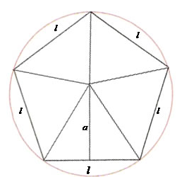

Para calcular a área de um pentágono regular, podemos dividi-lo internamente em triângulos, como mostra a imagem.  Se determinarmos as medidas da base e da altura de um destes triângulos, é possível calcular a área total  da figura.

Pensando nisso, faça uma função que recebe a medida de um dos lados do  pentágono e calcula sua área total.

Fonte da figura: [https://brasilescola.uol.com.br/matematica/area-um-poligono-regular.htm](https://brasilescola.uol.com.br/matematica/area-um-poligono-regular.htm)
