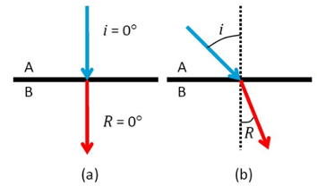

A lei de Snell-Descartes define que a relação entre o ângulo de incidência e o ângulo de refração de um raio de luz atravessando de um meio para o outro é inversamente proporcional a razão dos índices de refração dos meios, que é dado pela seguinte fórmula:

$$\frac{n_1}{n_2} = \frac{sen(\theta_2)}{sen(\theta_1)}$$

Faça uma função que recebe os valores de $n_1$, $n_2$ e $\theta_1$ e retorna o valor do $\theta_2$. Os valores passados de $n_1$, $n_2$ são adimensionais, já os valores de $\theta_1$ e $\theta_2$ deverão ser recebidos e retornados em graus.

