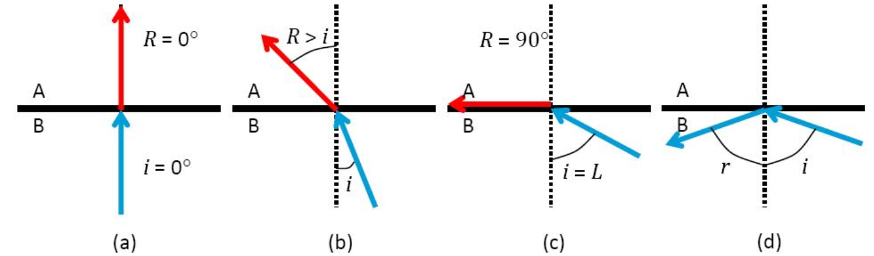

Um ângulo crítico de refração é definido quando um feixe de luz que atravessa de um meio de índice de refração maior para um menor é refratado paralelo a superfície. Ângulos de incidência maiores que este, farão a luz refletir internamente de forma total, e não mais refratar.

Faça uma função em Python que recebe os valores de $n_1$, $n_2$ e $\theta_2$ e informa se foi uma refração ou reflexão interna, sabendo que o feixe de luz vai **do meio 2 para o meio 1**. Para isso crie uma função que recebe os valores e retorne verdadeiro caso seja uma reflexão interna total (não inclui o ângulo crítico), ou falso caso seja uma refração. Dica: Um valor de seno maior que 1 (um) indica uma reflexão total interna.

