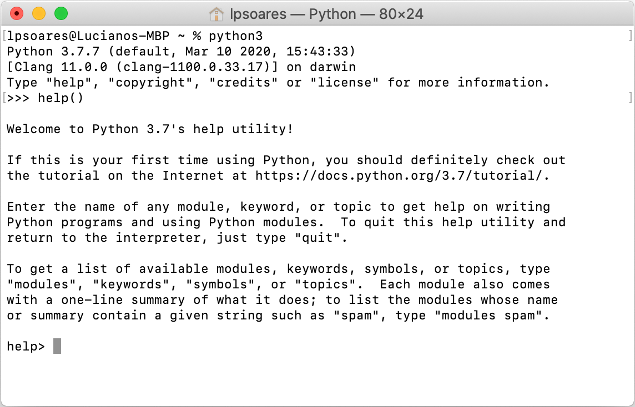
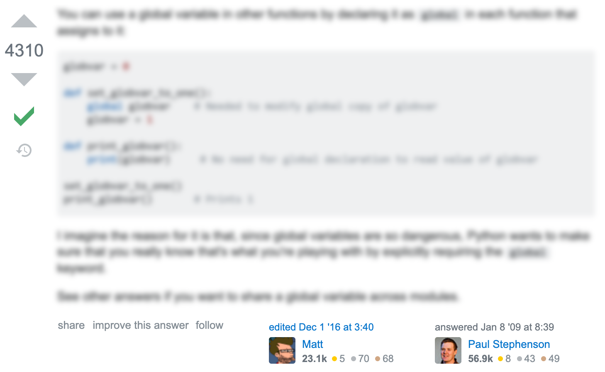

# Buscando Ajuda

Em programação é muito importante saber buscar informações. Buscar a forma correta de se utilizar um comando, descobrir quais são as possibilidades oferecidas por uma determinada biblioteca, ou mesmo procurar ideias de como resolver um problema. Existem tantas possibilidades que mesmo programadores experientes precisam procurar informações na internet em alguns momentos. Lição número um: não tenha vergonha de procurar respostas na internet. Mais do que isso, precisamos desenvolver estratégias eficientes para buscar essas informações. Quais fontes são confiáveis? Que termos devemos utilizar nas buscas?

Algumas das respostas são aprendidas com a experiência, mas a seguir fornecemos uma pequena lista de possibilidades de onde procurar informações.

## Documentação

A [documentação da linguagem Python](https://www.python.org/doc/) possui diversos recursos para programadores de todos os níveis. Muitas vezes quando procuramos por funções ou operadores mais básicos da linguagem na internet o link da documentação (https://docs.python.org/3/) aparece como uma das primeiras respostas. Procure dar prioridade para essa resposta, pois será mais confiável.

:::admonition{type="danger" title="Importante"}
A versão atual do Python é o Python 3. Existe muito material na internet referente à versão Python 2. Mesmo quando for entrar no link da documentação, certifique-se de que está acessando a documentação do Python 3 (https://docs.python.org/3/) e não do Python 2 (https://docs.python.org/2/).
:::

A documentação também pode ser acessada pelo terminal. Para isso, digite o comando `python` no terminal para entrar no modo interativo do Python e então digite o comando `help()` para entrar no modo de documentação. Nesse modo você pode digitar o nome de um comando ou módulo para ler a sua documentação.

## StackOverflow

O [StackOverflow](https://stackoverflow.com/) é um site que agrega perguntas e respostas relacionadas a programação. Muitas das respostas de buscas na internet relacionadas a programação acabam caindo em algum link desse site.

:::admonition{type="danger" title="Importante"}
Nem todas as respostas encontradas no StackOverflow são confiáveis. É importante aprender a identificar se uma resposta é confiável ou não.
:::

Algumas dicas para verificar respostas do StackOverflow:

1. **Teste o código:** se você está procurando por uma resposta que é um trecho de código, você pode testá-lo em seu próprio programa para ver se ele funciona. Se ele não funcionar já é um bom indício de que não é o que você estava procurando. Mas mesmo se ele funcionar, isso não quer dizer que foi uma boa resposta. Verifique os pontos a seguir.
1. **Verifique qual foi a resposta aceita:** ao lado das respostas é possível visualizar qual foi a resposta aceita e quantos votos ela recebeu. No exemplo abaixo vemos que a resposta foi aceita como correta e recebeu 4310 votos positivos (ambos indicados do lado esquerdo).
    
1. **Verifique a reputação do autor da resposta:** os pontos de reputação não são um fator definitivo. É possível que pessoas com poucos pontos de reputação dêem a resposta exata para o seu problema ou pessoas com muitos pontos de reputação dêem uma resposta errada ou desatualizada. De qualquer forma, se a pessoa que respondeu a pergunta possui muitos pontos de reputação é um bom sinal de que a resposta pode ser confiável. No exemplo acima o autor possui 56,9 mil pontos de reputação e a pessoa que editou a resposta, 23,1 mil (ambos são relativamente altos).

## Outros recursos online

Existem diversos recursos gratuitos disponíveis na internet para aprender Python. Aqui apresentamos alguns que podem ser úteis:

### Cursos online

- Enthought Academic: https://www.enthought.com/
- Codecademy: http://www.codecademy.com/en/tracks/python
- Learn Python: https://learnpython.trinket.io/
- Learn Python (o nome é o mesmo, mas é outro site): https://www.learnpython.org/

### Mais exercícios

- Codewars: https://www.codewars.com/collections/basic-python
- Project Euler (desafios matemáticos para serem resolvidos com programação): https://projecteuler.net/
- Olimpíada Brasileira de Informática: https://olimpiada.ic.unicamp.br/pratique/
