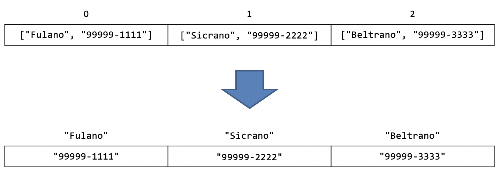

# Dicionários

O objetivo de aprendizado deste handout é que, ao final da atividade, você seja capaz de utilizar dicionários em seus programas em conjunto com as estruturas que vimos nas aulas anteriores (`#!python input`, `#!python if`, `#!python while`, `#!python for`, `#!python list`, etc.). Vamos começar com um aquecimento.

## Exemplo com listas

Analise o código abaixo:

::snip{file=raw/dicionario/telefones.py}

:::admonition{type=exercise title="EXERCÍCIO 1"}

Discuta o código acima com um colega. Apresentem suas interpretações e depois validem a compreensão com a descrição a seguir.

:::

:::admonition{type=info}

Leia este bloco depois que tiver resolvido o exercício 1.

<ol>
    <li>Começamos o código criando uma lista na qual cada elemento é uma outra lista contendo dois elementos. O primeiro desses elementos é sempre um nome e o segundo é sempre o seu respectivo telefone;</li>
    <li>O usuário digita um nome;</li>
    <li>Para cada elemento <code>nome_e_telefone</code> da <code>lista</code> repetimos o bloco a seguir (note que a variável <code>nome_e_telefone</code> sempre vai guardar uma lista com exatamente dois elementos, o nome e o telefone):
        <ol>
            <li>Armazenamos o primeiro elemento (o nome) de <code>nome_e_telefone</code> em uma variável <code>nome</code>;</li>
            <li>Se o nome for igual ao nome digitado pelo usuário executamos o bloco a seguir:
                <ol>
                    <li>Armazenamos o segundo elemento (o telefone) de <code>nome_e_telefone</code> em uma variável <code>telefone</code>;</li>
                    <li>Imprimimos o <code>telefone</code> da pessoa selecionada</li>
                </ol>
            </li>
        </ol>
    </li>
</ol>

:::

:::admonition{type=danger title="Importante"}

Mesmo depois de imprimir o telefone da pessoa selecionada, o código <b>continua percorrendo os próximos elementos da lista até o fim.</b>

:::

Acabamos de implementar uma lista de contatos!

No código acima, não seria mais fácil se eu pudesse acessar elementos de uma lista utilizando palavras ao invés de números (índices)? Assim eu poderia acessar, por exemplo, o telefone de `#!python "Fulano"` com o código `#!python lista["Fulano"]` ao invés de ter que procurar por todos os elementos da lista. Para isso temos os dicionários!

## Dicionários

Um dicionário pode armazenar uma quantidade arbitrária de elementos, assim como uma lista. A diferença é que não estamos limitados a utilizar números como os índices, em dicionários podemos indexar os elementos por quase qualquer coisa (floats, strings, etc.)! No exemplo da lista de contatos, poderíamos ter ao invés de uma lista de nomes e telefones indexados por números, uma lista de telefones indexada por nomes:



O problema disso é que na lista a posição de cada elemento está claramente associada a um número: o primeiro elemento da lista é o 0, o segundo é o 1, o terceiro é o 2 e assim por diante. No dicionário essa associação entre o índice (no exemplo, o nome) e a localização de um valor (o telefone) não é igualmente clara. Independente da ordem dos elementos no dicionário queremos utilizar os nomes para acessar os telefones. Por isso, ao criar um dicionário precisamos ser explícitos sobre qual é o "índice" de cada valor adicionado. Fazemos isso utilizando o seguinte código (ainda utilizando o exemplo acima):

```python
dicionario = {"Fulano": "99999-1111", "Sicrano": "99999-2222", "Beltrano": "99999-3333"}
```

A princípio pode parecer um pouco assustador, mas não se preocupe, com um pouco de prática você vai se acostumar. Vamos entender o que a linha acima está fazendo. Assim como definimos listas utilizando os colchetes `#!python []`, os dicionários são definidos com chaves `#!python {}`. Então definimos os pares de "índice" e valor do elemento separados por dois pontos ("`#!python :`").

### Chaves e valores

Talvez você tenha reparado que utilizamos aspas quando nos referíamos aos "índices" do dicionário. Na verdade, no dicionário chamamos os índices de **chaves** (em inglês: "*keys*") e os elementos armazenados de **valores** (em inglês: "*values*"). Vimos também que as chaves e valores estão associados. Esse par chave-valor é chamado de **item** (em inglês... também é "*item*"). Por exemplo, em:

```python
idades = {'Sicrano': 18, 'Beltrano': 20}
```

As chaves são `#!python 'Sicrano'` e `#!python 'Beltrano'`, os valores são `#!python 18` e `#!python 20` e os itens são `#!python ('Sicrano', 18)` e `#!python ('Beltrano', 20)`.

### Acessando valores em um dicionário

Vimos que podemos criar um dicionário colocando os pares de chaves e valores entre `#!python {` e `#!python }`. Para acessa um valor em uma determinada chave utilizamos o mesmo formato utilizado em listas. No nosso exemplo, `#!python dicionario['Sicrano']` devolve o valor armazenado na chave `#!python 'Sicrano'`, ou seja, `#!python '99999-2222'`.

:::admonition{type=exercise title="EXERCÍCIO 2"}

Reescreva o código da lista de contatos (no começo do handout) para utilizar dicionários. **Dica:** o `#!python for` não será mais necessário. É possível substituí-lo por uma única linha.

:::

:::admonition{type=exercise title="EXERCÍCIO 3"}

Uma possível solução para o [exercício 2](#exercicio-2) pode ser encontrada no [[TESTE DE MESA] Lista de contatos](http://softdes.insper.edu.br/exercicio/145). Faça esse teste de mesa para consolidar sua compreensão.

:::

## Inicialização de dicionários

Já vimos que podemos criar um dicionário indicando a chave e o valor separados por dois pontos:

```python
precos = {'chocolate': 5.0, 'suco': 4.0}
```

E que podemos guardar qualquer coisa em dicionários, inclusive listas ou até outros dicionários:

```python
colecao = {'Felipe': ['brontossauro', 'T-Rex'], 'Julia': ['Euro', 'Dolar', 'Bitcoin']}
```

Podemos também criar dicionários vazios de maneira similar às listas:

```python
dicionario_vazio = {}

# Também podemos criar da seguinte maneira
outro_dicionario_vazio = dict()
```

### Tem `#!python append`?

Em uma lista temos que usar o método `#!python .append()` para colocar um elemento extra (criando uma posição nova):

```python
minha_lista = []
minha_lista.append(42)
```

Em um dicionário **isso não é necessário**: basta colocar o novo elemento na nova posição (como fazemos quando queremos substituir um elemento em uma lista):

```python
meu_dicionario = {}
meu_dicionario['vida universo e tudo mais'] = 42
```

:::admonition{type=exercise title="EXERCÍCIO 4"}

Resolva o exercício [79. Lista para dicionário](http://softdes.insper.edu.br/exercicio/79).

:::

## Verificando se uma chave existe

:::admonition{type=exercise title="EXERCÍCIO 5"}

Teste o programa a seguir (**se der um erro é porque está certo**):

::snip{file=raw/dicionario/key_error.py}

:::

O resultado esperado do programa acima é o erro `#!python KeyError`. Por quê?

A chave `#!python 'alface'` não existe no dicionário, então o dicionário não tem um valor para devolver. Por esse motivo é importante verificarmos se uma chave existe no dicionário antes de tentar acessar seu valor. Para isso utilizamos o operador `#!python in`:

::snip{file=raw/dicionario/if_in.py}

Nesse caso, o programa vai imprimir: `#!python A palavra alface não existe no dicionário`.

:::admonition{type=exercise title="EXERCÍCIO 6"}

Resolva o exercício [44. Mês para número](http://softdes.insper.edu.br/exercicio/44). Mesmo se você já o tiver resolvido, resolva novamente **utilizando um dicionário, sem `#!python while` ou `#!python for`**.

:::

## Percorrendo um dicionário

Para percorrer os elementos de um dicionário vamos utilizar exclusivamente o `#!python for`. Existem 3 maneiras de percorrer um dicionário utilizando o `#!python for`. Para compreender as 3 maneiras, precisamos conhecer alguns métodos disponíveis em dicionários:

1. O método `#!python .keys()` (usado como `#!python dicionario.keys()`) devolve todas as chaves do dicionário;
1. O método `#!python .values()` (usado como `#!python dicionario.values()`) devolve todos os valores do dicionário;
1. O método `#!python .items()` (usado como `#!python dicionario.items()`) devolve todos os itens (pares chave-valor) do dicionário.

### Opção 1

A primeira opção para percorrer um dicionário utilizando `#!python for` é:

::snip{file=raw/dicionario/for_in.py}

Nessa opção, o bloco do `#!python for` é executado **para cada chave do dicionário**. Se você precisar do valor associado a essa chave é necessário acessar o valor no dicionário (primeira linha dentro do `#!python for`). Ela é equivalente a:

::snip{file=raw/dicionario/for_keys.py}

O `#!python .keys()` é redundante nesse caso, apresentamos a versão acima por completude. Você pode sempre usar a primeira versão (sem o `#!python .keys()`) sem prejuízo.

### Opção 2

A segunda opção para percorrer um dicionário possui um resultado similar ao `#!python for` com listas, ou seja, percorremos somente os valores:

::snip{file=raw/dicionario/for_values.py}

O programa acima vai imprimir `#!python kale`, `#!python cabbage`, `#!python broccoli` (um em cada linha). Note que nessa opção não temos acesso às chaves.

### Opção 3

Se você está interessado tanto nas chaves quando nos valores, é possível percorrer a lista da seguinte maneira:

::snip{file=raw/dicionario/for_items.py}

As variáveis `#!python port` e `#!python eng` serão inicializadas simultaneamente com a próxima chave e o próximo valor do dicionário.

## Removendo um item do dicionário

Assim como em listas, podemos remover um item utilizando o operador `#!python del`:

::snip{file=raw/dicionario/del_dict.py}

:::admonition{type=exercise title="EXERCÍCIOS ADICIONAIS"}

Resolva os exercícios disponíveis no servidor para praticar o uso de dicionários. Algumas sugestões:

<ul>
    <li><a href="http://softdes.insper.edu.br/exercicio/146">146. Conta ocorrências de palavras</a></li>
    <li><a href="http://softdes.insper.edu.br/exercicio/147">147. Palavra mais frequente</a></li>
    <li><a href="http://softdes.insper.edu.br/exercicio/148">148. Conta ocorrências de letras</a></li>
</ul>

:::
