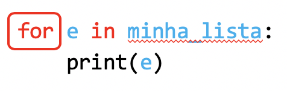

# 07. For

O objetivo de aprendizado deste handout é que, ao final da atividade, você seja capaz de utilizar o `#!python for` para percorrer listas e intervalos (`#!python range`) em seus programas em conjunto com as estruturas que vimos nas aulas anteriores (`#!python input`, `#!python if`, `#!python while`, etc.). Vamos começar com um exemplo.

## Percorrendo listas com `#!python while`

Considere a função a seguir, que recebe uma lista de números como argumento:

::snip{file="raw/for/soma_elementos.py"}

O que ela faz? Ela inicializa uma variável `#!python soma` com o valor zero e, **para cada elemento `#!python n` da lista**, adiciona o valor guardado em `#!python n` na variável `#!python soma` e **vai para o próximo elemento**. Depois disso, devolve o resultado da soma de todos os elementos. Depois de fazer muitos exercícios você pode ter percebido que em muitos casos temos uma estrutura muito parecida com essa quando estamos percorrendo uma lista:

::snip{file="raw/for/estrutura_while.py"}

Com essa estrutura podemos, por exemplo, imprimir ou somar todos os elementos de uma lista. Nesses casos, a lógica é sempre parecida: executa alguma ação **para cada elemento da lista**. Na verdade esse tipo de procedimento é tão comum que existe uma maneira mais sucinta de fazer isso em Python: a repetição `#!python for`.

## A repetição `#!python for`

O `#!python for` percorre automaticamente todos os elementos em uma lista, caracteres em uma string, e outras estruturas que veremos no futuro:

Ele se comporta de forma semelhante ao `#!python while` se considerarmos que ele executa o bloco de código  múltiplas vezes, mas uma diferença importante é que o `#!python for` **não possui condição**. Ele percorre todos os elementos e depois termina. Podemos ler o código abaixo:

como:

Assim, podemos reescrever o código a seguir:

utilizando o for:

Cada vez que o Python for executar o bloco dentro do `#!python for` a variável `#!python e` será automaticamente atualizada com o valor do próximo elemento da lista.

:::admonition{type=exercise title="EXERCÍCIO 1"}
Faça o exercício :challenge{type=trace slug=percorrendo-uma-lista-com-for}.
:::

:::admonition{type=exercise title="EXERCÍCIO 2"}
Quando utilizamos o `#!python for` com uma string, o Python executa o bloco **para cada caractere** dessa string. Sabendo disso, faça o exercício :challenge{type=trace slug=percorrendo-uma-string-com-for}.
:::

## O `#!python range`

Outra estratégia bastante comum em programação é o uso de contadores para percorrer números em um intervalo. Executamos uma determinada operação para o valor 0, depois para o valor 1, depois para o valor 2, e assim por diante. O Python possui uma função chamada `#!python range` que gera essa sequência de números naturais. Existem 3 maneiras de utilizar o `#!python range`:

- `#!python range` com **um** argumento: os números gerados vão desde o zero até o **antes** do argumento. Exemplo: `#!python range(3)` gera a sequência `#!python 0`, `#!python 1`, `#!python 2` (note que o `#!python 3` não pertence à sequência gerada);
- `#!python range` com **dois** argumentos: os números gerados vão desde o primeiro argument até **antes** do segundo argumento. Exemplo: `#!python range(13, 17)` gera a sequência `#!python 13`, `#!python 14`, `#!python 15`, `#!python 16` (note que o `#!python 13` pertence à sequência, mas o `#!python 17`, não);
- `#!python range` com **três** argumentos: os números gerados vão desde o primeiro argument até **antes** do segundo argumento e o terceiro argumento é o salto de um elemento gerado para o próximo. Exemplo: `#!python range(2, 13, 3)` gera a sequência `#!python 2`, `#!python 5`, `#!python 8`, `#!python 11` (note que o `#!python 2` pertence à sequência, mas o próximo elemento da sequência, o `#!python 14`, não).

:::admonition{type=exercise title="EXERCÍCIO 3"}
Faça o exercício :challenge{type=trace slug=percorrendo-um-range-com-for}.
:::

::::admonition{type=exercise title="EXERCÍCIOS ADICIONAIS"}

Refaça os exercícios a seguir utilizando `#!python for` e, quando necessário `#!python range`:

- :challenge{type=code slug=soma-dos-100-primeiros-termos}
- :challenge{type=code slug=calcula-fatorial}
- :challenge{type=code slug=soma-valores-da-lista}
- :challenge{type=code slug=numero-igual-ao-indice}
- :challenge{type=code slug=soma-dos-numero-impares}

Para praticar mais, refaça os outros exercícios que resolveu com [`#!python while`](/while/challenges) agora utilizando o `#!python for`.

:::admonition{type=danger title="Importante"}
Nem todos os exercícios podem ser resolvidos com o `#!python for`.
:::
::::
