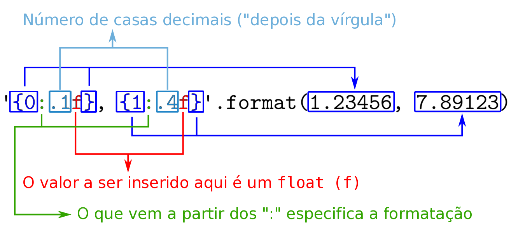

# 03. Entrada e saída do terminal

## Relembrando a aula passada...

Vamos começar relembrando o que aprendemos na aula passada com um exercício.

:::admonition{type=exercise title="EXERCÍCIO 1"}

Faça uma função que recebe um número e calcula:

$$f(x) = (-1)^x$$

Para testar, faça um programa que chama a sua função com argumentos diferentes. Mesmo que você tenha certeza que o seu programa está funcionando, é importante testá-lo. Por exemplo, qual é o resultado de $f(0)$? E $f(1)$, $f(2)$, $f(-1)$? Quantos testes você deve fazer para garantir que sua função está correta?

Reflita: o que a sua função faz? Qual seria um nome melhor para esta função?

Se você teve dificuldades para resolver este exercício, faça também o :challenge{type="trace" slug="verifica-par-ou-impar"}.

:::

### Exercícios adicionais

Caso você termine o programa acima antes da discussão com a sala, resolva os seguintes exercícios:

- :challenge{type="code" slug="movimento-retilineo-uniforme"}
- :challenge{type="code" slug="volume-de-uma-esfera"}
- :challenge{type="code" slug="lancamento-de-projetil"}

## Pedindo dados para o usuário

Até agora fizemos programas que, ao serem executados, sempre fazem exatamente a mesma coisa. Seria interessante permitir algum tipo de interação com o usuário. Por enquanto estamos desenvolvendo programas que imprimem valores no terminal, então também vamos utilizar o terminal para receber dados digitados pelo usuário.

Em Python, a função `#!python input()` pede um **texto** para o usuário e retorna este texto ao programa. Você pode, por exemplo, guardar esse texto em uma variável para usar em seguida. Teste o seguinte programa no seu computador:

```python
# Pede a cor favorita para o usuário.
cor_favorita = input('Qual a sua cor favorita? ')

# Imprime a cor favorita do usuário.
print(cor_favorita)
```

O programa acima deve imprimir `Qual a sua cor favorita? ` (note que existe um espaço após a interrogação) no terminal e parar. Nesse momento ele está esperando que o usuário digite algo no terminal. Até que isso aconteça, o programa fica parado na chamada da função `#!python input()`.

## Praticando o uso do `input`

Considere a seguinte função:

::snip{file="raw/input/soma1.py"}

Se criarmos um arquivo `.py` contendo somente esta função, o que você espera que aconteça? Rode seu programa. Ele fez o que você esperava?

O programa acima não vai fazer nada. Nós só estamos **definindo** a função `#!python soma`, mas não estamos pedindo para o Python executá-la (ou seja, não estamos chamando a função). O programa a seguir deve imprimir a soma dos números 14 e 28:

::snip{file="raw/input/soma2.py"}

Teste o programa acima e verifique se ele faz o que era esperado.

:::admonition{type=exercise title="EXERCÍCIO 2"}

Ao invés de deixarmos números fixos para testar a função, vamos perguntar para o usuário quais números ele quer somar. Teste o seguinte programa:

::snip{file="raw/input/soma3.py"}

Seu programa funcionou? Deu algum erro? Fez o que você esperava? Vamos tentar entender o que está acontecendo.

Lembre-se que a função `#!python input()` devolve o **texto** digitado pelo usuário. Na nossa soma, queremos adicionar **números**, não **texto**. Vamos tentar entender melhor o que está acontecendo.

:::

## Tipos de dados em Python

Vimos na aula passada que podemos guardar qualquer coisa em variáveis no Python. O que nós não discutimos foi que essas "coisas" que podemos guardar nas variáveis possuem tipos específicos. No início vamos trabalhar com 4 tipos básicos:

- **Inteiro (`#!python int`)**: um número sem casa decimal. Ex: `#!python 34`, `#!python 96`, `#!python -123`, `#!python 45`;
- **Float (`#!python float`)**: um número real, com "ponto decimal" (também chamamos de "ponto flutuante"). Ex: `#!python 3.14`, `#!python -25.1`, `#!python 5.0`, `#!python 5e-1`;
- **String (`#!python str`)**: texto puro (é representado necessariamente com aspas simples ou duplas). Ex: `#!python "Hello, world!"`, `#!python 'Insper'`, `#!python '3.14'`, `#!python '"oi"'`;
- **Booleano (`#!python bool`)**: representam "verdadeiro" (`#!python True`) e "falso" (`#!python False`).

::::admonition{type=exercise title="EXERCÍCIO 3: Conversão entre tipos"}

O Python disponibiliza algumas funções que convertem um valor de um tipo para outro. Teste o seguinte programa:

::snip{file="raw/input/tipos.py"}

:::admonition{type="danger" title="Erros na execução"}
Seu programa deve ter apresentado um erro parecido com o seguinte: `#!python ValueError: could not convert string to float: 'banana'`. Será **muito** comum encontrarmos erros em nosso programa. A primeira dica é: não entre em pânico. A segunda é: leia a mensagem de erro com atenção.

:::
::::

### Exercício adicional

O comando `#!python int(3.14)` gerou o número inteiro `#!python 3`. Mas será que ele arredondou o valor? Teste o comando `#!python int(2.718)`. Assumindo que a função `#!python int()` arredonda o valor, o resultado esperado seria `#!python 3`. Rode seu programa. Qual foi o resultado? O que isso diz sobre a função `#!python int`?

:::admonition{type=exercise title="EXERCÍCIO 4: Agora vai!"}

Corrija o programa do exercício 3 sabendo que o `#!python input()` **sempre** devolve uma _string_, ou seja, o texto digitado pelo usuário e a nossa função `#!python soma(x, y)` recebe dois _números_.

:::

## Formatação de strings

Na aula passada vimos que podemos formatar uma string utilizando a função `#!python .format()` para incluir os valores armazenados em variáveis. Por exemplo:

::snip{file="raw/input/str_format.py"}

Esse programa vai imprimir `#!python a vale 10, b vale 7 e a + b = 17` no terminal. Agora, o que acontece se o valor da variável for um `#!python float`? Teste o programa a seguir.

::snip{file="raw/input/str_format_float.py"}

Quantas casas decimais do número pi foram apresentadas? E se quisermos mostrar apenas as 3 primeiras?

Para isso podemos usar [diretivas de formatação](https://docs.python.org/3.7/library/string.html#formatspec), que podem ser especificadas com um "`#!python :`" (dois pontos) depois do índice. Por exemplo `#!python '{0:.1f}, {1:.4f}'.format(1.23456, 7.89123)` vai gerar a string `#!python '1.2, 7.8912'`. Vamos por partes:



:::admonition{type=exercise title="EXERCÍCIO 5"}

Modifique o programa que imprime o valor de pi para que ele mostre somente as 3 primeiras casas decimais.

:::

:::admonition{type=danger title="Maneiras antigas de formatar strings em Python"}
Se você procurar na internet por "formatação de strings em Python" ou algum termo análogo, é bastante provável que você encontre formas diferentes da que apresentamos acima. Por exemplo:

::snip{file="raw/input/str_format_antigo.py"}

Não se preocupe se não entender esse trecho de código. Essa é a maneira antiga de formatar strings em Python. Procure utilizar a maneira nova que ensinamos, pois ela é mais flexível.
:::

## Operações com strings

No programa do exercício 2 nós obtivemos um comportamento diferente do que esperávamos (se precisar, execute o programa novamente para relembrar). Nessa versão do programa, se o usuário digitar `#!python 4` e `#!python 2` o programa vai imprimir que a soma vale `#!python 42`. Vimos que isso ocorre porque a função `#!python input()` sempre devolve uma string, então o que o programa fez foi juntar a string `#!python '4'` com a string `#!python '2'`, obtendo a string `#!python '42'`. Essa operação de "juntar strings" é o que chamamos de **concatenação**.

:::admonition{type=exercise title="EXERCÍCIO 6"}

Antes de executar o programa a seguir, reflita: o que você espera que seja a saída dele, ou seja, o que você espera que apareça no terminal? Depois que tiver sua hipótese, execute o programa.

::snip{file="raw/input/str_concat.py"}

Se o programa não fez o que você esperava, discuta com seus colegas. Se não conseguirem resolver, converse com algum dos professores.

:::

:::admonition{type=exercise title="EXERCÍCIO 7"}

Vamos voltar por um instante para o contexto numérico. Sabe-se que uma multiplicação é equivalente à adição sucessiva de um mesmo número. Por exemplo: `#!python 3 * 4 = 4 + 4 + 4 = 12`. Sabendo disso e considerando o que acabamos de aprender sobre concatenação (`#!python +`) de strings, qual você espera que seja a saída do programa a seguir? Execute-o para validar sua hipótese.

::snip{file="raw/input/str_mult.py"}

:::

### Exercícios adicionais

- :challenge{type="code" slug="total-em-segundos"}
- :challenge{type="code" slug="reducao-no-tempo-de-vida-de-um-fumante"}
- :challenge{type="code" slug="repete-asteriscos"}

Se terminar os exercícios acima, faça os [outros exercícios](/input/challenges).

### Desafio

Faça um programa que pergunta ao usuário um numero n entre 1 e 20 e imprime um quadrado de asteriscos n x n. Exemplo de uso:

```
Digite n: 3

***
***
***
```

Para cumprir essa missão você precisa saber que a string `#!python "\n"` significa _"pule para a próxima linha"_. Por exemplo:

```python
print("abc\nde")
```

imprime

```
abc
de
```

# Referências

- https://docs.python.org/3.7/tutorial/inputoutput.html
- https://docs.python.org/3.7/library/string.html#formatspec
