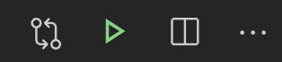

# 01. Introdução ao Python, Variáveis e Operações Matemáticas

## O Python

O nome Python teve a sua origem no grupo humorístico britânico [Monty Python](https://pt.wikipedia.org/wiki/Monty_Python) (se tiver curiosidade, é possível encontrar alguns títulos no Netflix).


A linguagem Python foi desenvolvida por [Guido van Rossum](https://en.wikipedia.org/wiki/Guido_van_Rossum) no início da década de 1990. Apesar de ser uma linguagem relativamente antiga, o seu uso apresentou [um crescimento significativo nos últimos anos](https://stackoverflow.blog/2017/09/06/incredible-growth-python/) e é hoje uma das linguagens de programação mais populares no mundo, sendo [amplamente utilizada por grandes empresas](https://www.python.org/about/quotes/) como Google, Netflix, Nasa, Dropbox, e muitos outros.

Neste primeiro *handout* vamos desenvolver nossos primeiros programas em Python, utilizando os seguintes conceitos básicos de programação: operações matemáticas, variáveis e funções.

## Instalação

Existem diversas formas de instalar o Python. Recomendamos a instalação através do Anaconda, que já inclui o Python e alguns módulos adicionais que serão úteis em outras disciplinas. Para isso, acesse o link de instalação referente ao seu sistema operacional:

- Windows: https://docs.anaconda.com/anaconda/install/windows/
- macOS: https://docs.anaconda.com/anaconda/install/mac-os/
- Linux: https://docs.anaconda.com/anaconda/install/linux/

Para escrever e editar o nosso código será necessário utilizarmos um editor de código. Existem diversas alternativas, mas nesta disciplina focaremos no [Visual Studio Code](https://code.visualstudio.com/) (VS Code), um dos editores mais populares atualmente. Veremos que o código é essencialmente texto, então poderíamos utilizar qualquer editor de texto disponível, mas editores como o VS Code possuem diversas ferramentas que facilitam o desenvolvimento.

É provável que o VS Code já tenha sido instalado juntamente com o Anaconda. Para verificar, abra o Anaconda Navigator (um programa instalado com o Anaconda), procure pelo VS Code e clique em *Launch*. Se ele mostrar a opção de instalar, você pode instalá-lo pelo próprio Anaconda Navigator. Caso contrário, você pode fazer o download no seguinte link: https://code.visualstudio.com/Download

## Olá Mundo!

Quando vamos aprender uma nova linguagem de programação é comum escrevermos um primeiro programa que, ao ser executado, mostra na tela o texto *Hello, world!* ("Olá, mundo!"). Apesar de ser um programa muito simples, ele já nos permite começar a compreender dois aspectos da linguagem:

1. Qual é a "cara" da linguagem, ou seja, qual é a estrutura básica do código.
2. Como executar um programa escrito nessa linguagem.

Então mãos à obra!

:::admonition{type=exercise title="EXERCÍCIO 1"}

Siga os passos a seguir para escrever e executar seu primeiro programa em Python:

1. Abra o VS Code.
2. Crie um novo arquivo clicando em "File --> New File" ou utilizando o atalho `ctrl+n` (Windows)/`cmd+n` (macOS).
3. Salve o arquivo com o nome `hello.py`. Para isso, clique em "File --> Save", preencha o nome, escolha uma pasta para salvar o arquivo e clique em "Save".
4. Digite o código `#!python print('Hello, world!')`
    
5. Salve o arquivo clicando em "File --> Save" ou usando o atalho `ctrl+s` (Windows)/`cmd+s` (macOS).
6. Execute seu programa. Para executar um programa em Python, temos quatro possibilidades:
    1. Clique em "Run --> Run Without Debugging"
    2. Utilize o atalho `ctrl+F5`
    3. Clique na setinha verde no canto superior direito:
        
    4. [Avançado] [Utilizando o terminal](/terminal-win) para ir até a pasta onde se encontra o arquivo e executando-o com o comando `python hello.py`
7. O texto *Hello, world!* deve aparecer no terminal.

:::

### Entendendo nosso primeiro programa

Nosso código possui apenas uma linha, mas já contém diversos conceitos importantes. Não se preocupe se não entender toda a explicação a seguir, tudo ficará mais claro conforme formos aprendendo mais. A linha `#!python print('Hello, world!')` pode ser lida como: "Python, por favor, mostre na tela o texto `#!python Hello, world!`. Vamos por partes.

<span id="print-arg"></span>

Comecemos pela a função `#!python print`. Essa função é utilizada para mostrar texto no terminal. Podemos entender uma função como um comando do Python, ou seja, estamos dizendo para o Python **fazer** algo. A ação de mostrar algo na tela depende de uma informação adicional: o que deve ser mostrado. Essa informação da qual a ação depende é chamada de **argumento da função**. No nosso exemplo, o argumento da função `#!python print` é o texto `#!python 'Hello, world!'`.

Um último detalhe importante é o uso das aspas. Para indicar que `#!python Hello, world!` é um texto nós utilizamos aspas, que podem ser simples ou duplas. Isso é muito importante, pois o que estiver entre aspas será considerado pelo Python como texto (que chamamos de *string*) e não como um comando (por exemplo a função `#!python print`).

:::admonition{type=info title="Dica Pro: documente o código!"}

Uma lição a ser aprendida é que passamos **muito** mais tempo lendo código pré-existente do que escrevendo código novo. Por isso a documentação do código é uma prática extremamente importante. A documentação pode ser feita por meio de comentários, trechos de texto que não afetam o comportamento do programa, que ajudam o leitor (seja algum colega de trabalho que não conhece o código ou você mesmo algum tempo no futuro) a compreender o código.

Veja a seguir um exemplo do mesmo programa que acabamos de executar, mas com documentação:

::snip{file="raw/introducao/hello.py"}

O texto entre `#!python """` será ignorado pelo programa. Note que nesse comentário podemos encontrar informações como:

- O que o código faz;
- Por que ele foi escrito;
- Quem escreveu o código.

Esse primeiro programa ainda é muito simples, mas conforme formos desenvolvendo programas mais complexos os comentários se tornam cada vez mais relevantes.

:::

:::admonition{type=info title="Buscando ajuda"}

Depois de pensar e tentar resolver problemas por conta própria e não encontrar a solução, não tenha vergonha de procurar ajuda na internet. Até mesmo programadores experientes fazem isso. É importante, entretanto, saber como fazer essas buscas: que termos usar, quais respostas confiar, etc. Você vai desenvolver uma intuição conforme for ganhando experiência, mas para te ajudar neste começo, escrevemos um [pequeno guia com algumas dicas](/buscando-ajuda).

:::

## Operações matemáticas

Queremos usar o Python para fazer algo além de só mostrar um texto na tela. Para isso vamos começar aprendendo sobre como realizar operações matemáticas.

::::admonition{type=exercise title="EXERCÍCIO 2"}

Crie um novo arquivo chamado `operadores.py` no VS Code e copie o código a seguir. Execute-o e tente identificar a partir dos resultados o que cada operador faz. Discuta com seus colegas.

::snip{file="raw/introducao/operadores_simples.py"}

:::admonition{type=danger title="Importante"}

O programa em Python é executado linha a linha, ou seja, as linhas do programa são executadas uma após a outra de cima para baixo. **Uma linha de código só é executada depois que a linha anterior terminou de executar.**

:::

::::

::::admonition{type=success title="Resposta" collapse}

Leia a resposta apenas depois de discutir com seus colegas.

O código abaixo foi comentado com as respostas. Comentários em Python são iniciados com o caractere cerquilha (`#!python #`). Tudo o que vier depois desse caractere será ignorado pelo programa.

::snip{file="raw/introducao/operadores.py"}

:::admonition{type=info title="Mais alguns detalhes..." collapse}

No programa acima podemos observar mais alguns detalhes:

- A cerquilha (`#!python #`) que inicia um comentário pode ser inserida no começo de uma linha ou precedida por 2 espaços depois de um trecho de código. Esses dois espaços antes da cerquilha não são obrigatórios, mas são um padrão adotado pela comunidade Python.
- Os operadores e números estão separados por espaços. Esses espaços também não são obrigatórios, mas facilitam na interpretação visual.

:::
::::

A ordem de prioridade dos operadores em Python segue a convenção matemática do PEMDAS:

- **P**arênteses têm a maior prioridade e pode ser usado para forçar uma expressão a ser avaliada na ordem que você quiser.
- **E**xponenciação tem a próxima precedência mais alta.
- **M**ultiplicação e
- **D**ivisão têm a mesma precedência, que é maior do que a
- **A**dição e
- **S**ubtração.

Além disso, as operações de mesma prioridade são avaliadas da esquerda para a direita.

:::admonition{type=exercise title="EXERCÍCIO 3"}

Escreva um programa em Python que imprime (mostra na tela com o comando `#!python print`) o resultado das seguintes expressões numéricas:

1. $1 + \frac{1}{2} + \frac{1}{2^2} + \frac{1}{2^3} + \frac{1}{2^4}$ (resposta esperada: `#!python 1.9375`)
2. $\frac{3\cdot4+5}{1+2\cdot3}$ (resposta esperada: `#!python 2.4285714285714284` --> não se preocupe se der alguma diferença nas últimas casas decimais)
3. $\sqrt{3^2+4^2}$ (resposta esperada: `#!python 5.0`)

:::

## Variáveis

Podemos armazenar valores ou resultados de expressões matemáticas em variáveis. Uma variável é como se fosse uma caixa com uma etiqueta com o seu nome. O conteúdo armazenado na caixa pode ser acessado a partir do nome em sua etiqueta. Considere o exemplo a seguir:

```python
x = 5
print(x)
```

Devemos ler a primeira linha como: "a variável x **recebe** o valor 5". É como se disséssemos: "interpretador Python, por favor, crie na memória do computador uma caixa chamada `#!python x` e guarde lá dentro o valor `#!python 5`."

A linha seguinte pede para o Python imprimir o **conteúdo** da variável `#!python x`, nesse caso, `#!python 5`. Assim, o Python vai escrever `#!python 5` no terminal.

Podemos usar variáveis dentro de outras expressões. Por exemplo:

::snip{file="raw/introducao/variaveis.py"}

:::admonition{type=info}

Usamos o `#!python .format()` para escrever valores no meio do texto. É importante notar que:

1. A sequência dos argumentos (conteúdo dentro dos parênteses do `#!python .format()`) é importante.
2. O primeiro argumento (`#!python x`) será inserido no lugar do `#!python {0}`, o segundo argumento (`#!python y`) será inserido no lugar do `#!python {1}` e o terceiro argumento (`#!python z`) será inserido no lugar do `#!python {2}`.
3. Em Python (e em programação em geral) começamos a contar a partir do zero, ou seja, 0 é o primeiro, 1 é o segundo, 2 é o terceiro e assim por diante.
4. O `#!python .format()` é executado primeiro, escrevendo os valores no meio do texto, e depois o resultado é utilizado pela função `print()`, mostrando o resultado na tela.

:::

::::admonition{type=exercise title="EXERCÍCIO 4"}

Resolva o exercício :challenge{type="trace" slug="variaveis"}.

:::admonition{type=info title="Teste de Mesa"}

O teste de mesa consiste em simular manualmente a execução de um programa. O processo se dá da seguinte forma:

1. Execute as operações da linha atual (no servidor de desafios a linha atual é destacada em vermelho). No início da execução a linha atual é a primeira linha de código.
2. Atualize o valor das variáveis na memória. No servidor existe uma região à direita chamada "Memória". Você deve atualizar as variáveis nessa região com os valores obtidos após a execução da linha atual. Se a linha atual não modificou alguma variável ela deve permanecer inalterada na memória.
3. Se a função `#!python print` foi utilizada na linha atual, escreva na região chamada "Saída do terminal" (fundo preto) o que aparecerá no terminal.
4. Prepare-se para a execução da próxima linha. No servidor é necessário selecionar o número da próxima linha a ser executada em "Próxima linha".
5. Clique em "Próximo passo".

É possível realizar um teste de mesa apenas com papel e caneta. Você pode sempre utilizar esse processo para verificar se o seu programa faz o que era esperado.

:::

::::

Podemos usar variáveis para armazenar qualquer tipo de dados em Python:

::snip{file="raw/introducao/variaveis2.py"}

:::admonition{type=danger}
Considere as primeiras linhas de código (8 e 9), depois dos comentários. Aqui vemos a importância das aspas. Ao executar a linha 9 o Python mostrará na tela a string armazenada na variável `#!python disciplina`, ou seja, `#!python Design de Software`. Se utilizássemos aspas na linha 9 (`#!python print('disciplina')`) o Python mostraria o **texto** `#!python disciplina` no terminal.
:::

:::admonition{type=exercise title="EXERCÍCIO 5"}

Faça o exercício :challenge{type="trace" slug="mais-variaveis"}.

:::
