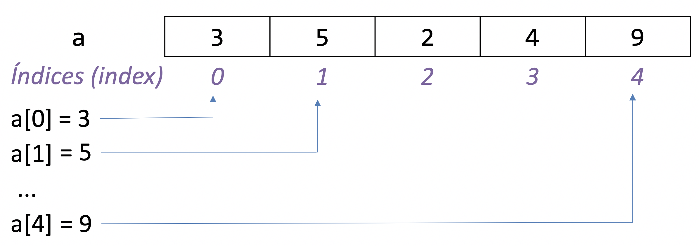

# 06 - Listas

O objetivo de aprendizado deste handout é que, ao final da atividade, você seja capaz de utilizar listas em seus programas em conjunto com as estruturas que vimos nas aulas anteriores (`#!python input`, `#!python if`, `#!python while`, etc.). Vamos começar com um aquecimento.

:::admonition{type=exercise title="EXERCÍCIO 1"}

Utilizando apenas o que já vimos sobre Python, implemente um programa que pergunta para o usuário a nota de 3 alunos e armazena cada nota em uma variável. Depois de receber os 3 valores, imprima as notas e a média. Para o usuário, seu programa deve se comportar da seguinte maneira caso ele digite `#!python 8`, `#!python 2` e `#!python 8` (esse é um exemplo de saída do terminal):

```bash
Digite a nota 1: 8
Digite a nota 2: 2
Digite a nota 3: 8
Notas digitadas:
8
2
8
Média: 6
```
:::

:::admonition{type=exercise title="EXERCÍCIO 2"}
Altere seu programa do exercício 1 para que ele pergunte 6 notas ao invés de 3. Note que será necessário alterar seu código que imprime todas as notas digitadas e a média. Dica: a solução envolve basicamente copiar e colar código.
:::

## E se fosse um MOOC (Massive Open Online Course)?

O que aconteceria se ao invés de 6 notas tivéssemos 10000 notas? Ainda seria possível (mas definitivamente não recomendável) copiar e colar as mesmas linhas para adaptar o código para essa nova situação. Pior, sempre é possível que o usuário precise de 1 nota a mais e você teria que alterar o seu programa novamente. O problema é que o programa escrito dessa forma pode armazenar uma **quantidade fixa** de notas. Seria interessante termos alguma forma de armazenar uma **quantidade variável** de notas, que fosse aumentando conforme a demanda. É aí que entram as listas em Python.

## O tipo `#!python list`

Listas são uma das mais formas mais comuns de se organizar uma sequência de dados em Python. Para acessar um dado armazenado em uma lista utilizamos a sua posição, ou índice. Por exemplo, o código a seguir cria uma lista com os números `#!python 3`, `#!python 5`, `#!python 2`, `#!python 4` e `#!python 9` e a armazena em uma variável chamada `#!python a`:

```python
a = [3, 5, 2, 4, 9]
```

Lembrando que em programação começamos a contar a partir de zero, o elemento no índice 0 (zero) é o primeiro elemento (número `#!python 3`), no índice 1 é o segundo elemento (número `#!python 5`), no índice 2 é o terceiro elemento (número `#!python 2`) e assim por diante. Note que **o último índice possível é igual ao tamanho da lista subtraído por 1**. No nosso exemplo, o índice do último elemento é 4 e a lista tem tamanho 5.



## Cabe tudo em uma lista!

Uma característica importante de listas é que elas podem guardar qualquer tipo de dados disponível no Python. Basta colocar os itens entre **colchetes** e separá-los por **vírgulas**. Por exemplo:

```python
lista_de_strings = ['banana', 'abobora', 'maçã', 'jaca']
lista_de_ints = [3, 5, 2, 1, 3]  # Sim, pode ter elementos repetidos
lista_de_floats = [3.14, 2.7, 1.00001]
```

Podemos inclusive criar listas vazias:

```python
sacola_de_compras = []
```

Mas qual é a utilidade de criar uma lista vazia? Você se lembra que comentamos acima sobre armazenar uma quantidade variável de elementos? Em uma lista é possível adicionar novos elementos conforme a necessidade.

## Acessando elementos de uma lista

Para acessar um elemento de uma lista utilizamos a sua posição (índice) entre colchetes. Por exemplo, para acessar o terceiro elemento da lista `#!python a = [3, 5, 2, 4, 9]` utilizamos o comando `#!python a[2]`.

:::admonition{type=exercise title="EXERCÍCIO 3"}
Faça o exercício :challenge{type=trace slug=imprimindo-elementos-de-uma-lista}.
:::

## Descobrindo o número de elementos em uma lista

Podemos utilizar a função `#!python len()` para descobrir o tamanho de uma lista, ou seja, quantos elementos estão disponíveis nessa lista.

:::admonition{type=exercise title="EXERCÍCIO 4"}
Sabendo disso, utilize seus conhecimentos de `#!python while` da aula passada para resolver o exercício :challenge{type=trace slug=imprimindo-elementos-de-uma-lista-com-while}.
:::

:::admonition{type=exercise title="EXERCÍCIO 5"}
Resolva o exercício :challenge{type=code slug=soma-valores-da-lista}. Dica: será necessário criar pelo menos duas variáveis auxiliares, uma para guardar o índice e outra para guardar a soma.
:::

## Substituindo elementos em uma lista

Podemos também substituir o elemento em um índice específico da lista. Por exemplo, na lista `#!python a = [1, 2, 5, 7]` podemos substituir o segundo elemento pelo número 3 da seguinte maneira:

::snip{file="raw/lista/substituindo.py"}

:::admonition{type=exercise title="EXERCÍCIO 6"}
Sabendo disso, resolva o exercício :challenge{type=trace slug=corrigindo-a-lista-de-primos}.
:::

:::admonition{type=exercise title="EXERCÍCIO 7"}
Resolva o exercício :challenge{type=code slug=substitui-valores-negativos-por-zero}.
:::

## Adicionando e removendo elementos em uma lista

Comentamos anteriormente que a lista pode guardar uma quantidade arbitrária de elementos. Essa quantidade pode, inclusive, mudar ao longo do tempo. Podemos adicionar e remover elementos a uma lista com o operador `#!python del` e a função `#!python .append()`.

:::admonition{type=exercise title="EXERCÍCIO 8"}
Para entender como esses comandos funcionam, faça o exercício :challenge{type=trace slug=adicionando-e-removendo-elementos-de-uma-lista}.
:::

:::admonition{type=exercise title="EXERCÍCIO 9"}
Resolva o exercício :challenge{type=code slug=palavras-iniciadas-em-a}.
:::

## Soma e multiplicação de listas?

Existe a opção de somarmos uma lista a outra. O resultado é **uma nova lista** com os elementos de ambas. Por exemplo:

::snip{file="raw/lista/somando.py"}

Além disso, também temos a opção de multiplicar uma lista por um número inteiro. Lembrando da matemática, multiplicar um número $m$ por outro número $n$ é o mesmo que somar $m$ com ele mesmo $n$ vezes. Ao multiplicarmos uma lista por um número temos um resultado análogo:

::snip{file="raw/lista/multiplicando.py"}

**Observação:** esse comportamento é **muito** semelhante às somas e [multiplicações de strings](/input/#operacoes-com-strings).

:::admonition{type=exercise title="EXERCÍCIO 10"}
Faça o exercício :challenge{type=trace slug=soma-e-multiplicacao-de-listas}.
:::

:::admonition{type=exercise title="EXERCÍCIOS ADICIONAIS"}
Como sempre, resolva os [outros exercícios disponíveis](/lista/challenges).
