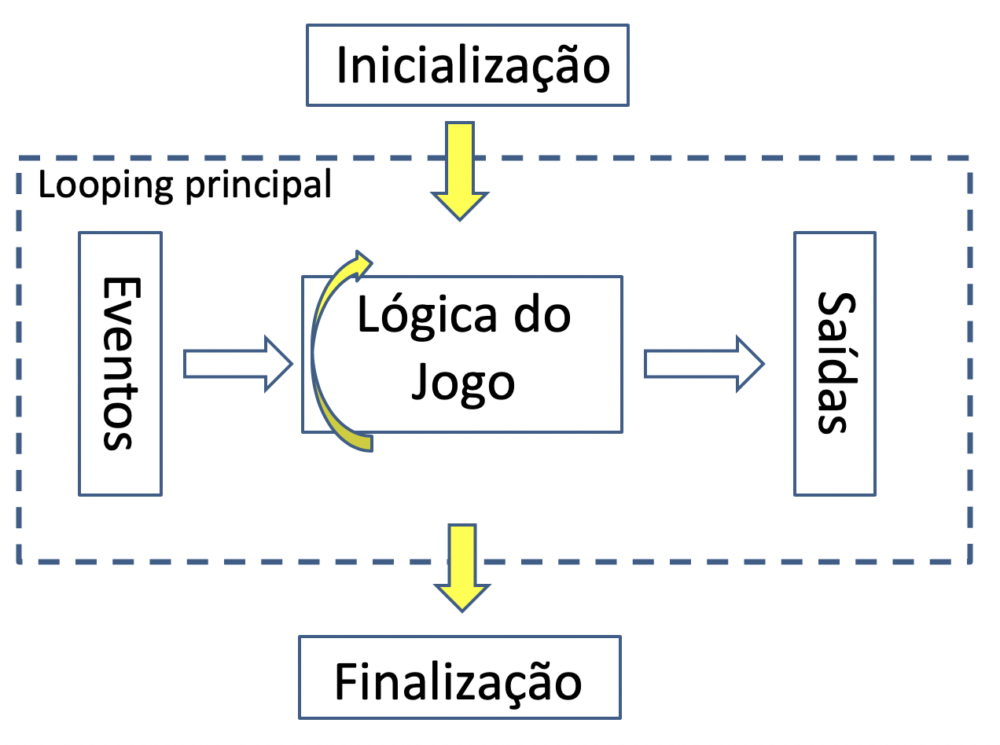
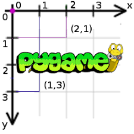

# 12. PyGame

Neste handout vamos começar a nos preparar para desenvolver o projeto final de Design de Software. Para isso vamos apresentar uma biblioteca de desenvolvimento de jogos em Python chamada pygame. Ao final deste handout você terá implementado um jogo simples baseado no Asteroids usando pygame.

## Estrutura básica de um jogo

Vamos começar entendendo a estrutura de um jogo qualquer. Note que este conhecimento independe da biblioteca ou linguagem de programação utilizada. Essa estrutura pode ser resumida da seguinte maneira:



Nas seções a seguir explicamos o que o programa faz em cada um desses blocos.

### Inicialização

- **Importa e inicia pacotes:** por exemplo, realiza os `#!python imports` no Python;
- **Inicia estruturas de dados:** por exemplo, inicia listas, dicionários, variáveis, etc. com seus valores padrão;
- **Inicia assets:** exemplos de *assets* são imagens, sons, sprites, modelos 3D, etc. que são utilizados pelo jogo;
- **Gera tela principal:** criar a janela onde o jogo será apresentado;
- **Dispara loop principal:** depois que toda a inicialização está concluída o jogo propriamente dito se inicia.

### Loop principal

O jogo e toda a interação acontece durante esta fase. O loop principal, também chamado de *game loop*, se repete enquanto o jogo estiver rodando. Em geral, ao final de uma iteração do loop principal será gerado um novo frame para ser apresentado para o usuário.

- **Trata eventos:** por exemplo, movimentos/cliques de mouse, input de teclado, timer, clique do usuário no X para fechar a janela, etc.
- **Verifica consequências:** verifica se houve colisões, aplica as ações do usuário (por exemplo, muda a direção do personagem se o jogador apertou uma tecla), etc. de acordo com as regras e mecânica do jogo;
- **Atualiza estado do jogo:** move os objetos na tela, atualiza os estados dos *assets* (por exemplo, muda a animação) e as estruturas de dados utilizadas (por exemplo, atualiza a lista de personagens vivos);
- **Gera saídas:** exibe as mudanças para o jogador (gera uma nova imagem/frame, toca um som, etc.).

### Finalização

Na finalização pode ser realizado o fechamento de arquivos, salvar o placar do jogo, fechar a janela do jogo, etc.


O [pygame](https://www.pygame.org/docs/) é um *framework* (ou *game engine*) para desenvolvimento de jogos em Python, baseado na biblioteca SDL2 (Simple DirectMedia Layer).

## Instalação

Abra o seu terminal (Linux ou MacOS) ou Anaconda Prompt (Windows) e digite:

    pip install pygame

## Preparo para o tutorial

Antes de seguir com o tutorial de pygame, faça o download do arquivo [`referencia.zip` (disponível neste link)](referencia.zip). Descompacte os arquivos em uma pasta, sem alterar a estrutura de pastas.

:::admonition{type=danger title="Importante"}
Consulte a [documentação](https://www.pygame.org/docs) se não entender algum dos comandos.
:::

## Criando uma janela

Veremos que será necessário utilizarmos muitos comandos para fazer coisas aparentemente simples, como mostrar uma janela em branco. Não se assuste. Muito desse código se repete de maneira muito semelhante em qualquer jogo que você for desenvolver. Vamos começar então com o exemplo que acabamos de comentar: como mostrar uma janela do pygame. Abra o arquivo `#!python referencia/jogo_v1.py`. Esse arquivo contém comentários que separam o código nos blocos descritos no início deste handout. Vamos entender o que esses comandos fazem:

:::admonition{type=info title="`referencia/jogo_v1.py`" collapse}
::snip{file="raw/pygame/referencia/jogo_v1.py" showLineNumbers}
:::

- `#!python pygame.init()` (linha 5): o framework pygame é iniciado. Apenas após este comando é que os recursos do pacote podem ser utilizados;
- `#!python pygame.display.set_mode((500, 400))` (linha 8): cria uma janela com 500 pixels de largura e 400 pixels de altura;
- `#!python pygame.display.set_caption('Hello World!')` (linha 9): define o título da janela (que aparece na barra superior) como o texto `#!python 'Hello World!'`;
- `#!python game = True` (linha 12): a variável `#!python game` será utilizada para indicar que o jogo deve continuar;
- `#!python while game:` (linha 15): continua o jogo enquanto `#!python game` for `#!python True`;
- `#!python for event in pygame.event.get():` (linha 17): `#!python pygame.event.get()` devolve uma lista com todos os eventos (cliques/movimentos de mouse, teclas apertadas, botões da janela apertados, etc.) que ocorreram desde a última vez que essa função foi chamada. O `#!python for` percorre cada um desses eventos, aplicando as consequências necessárias a cada caso;
- `#!python if event.type == pygame.QUIT:` (linha 19): verifica se o tipo do evento é `#!python pygame.QUIT`, ou seja, se o usuário clicou no botão de fechar a janela (consulte a [documentação](https://www.pygame.org/docs/ref/event.html#pygame.event.EventType) para ver mais eventos possíveis);
- `#!python game = False` (linha 20): muda o valor para `#!python False` para que a próxima iteração do loop principal não seja mais executada. Depois disso o programa termina;
- `#!python window.fill((255, 255, 255))` (linha 23): preenche a janela com a cor branca. As cores são valores RGB (Red, Green, Blue) que variam entre 0 e 255. Note que existe um parênteses ao redor dos três valores. Esse parênteses é muito importante, pois define uma *tupla* (uma sequência de valores, semelhante a uma lista);
- `#!python pygame.display.update()` (linha 26): tudo o que é feito na tela (`#!python window`) não é mostrado para o usuário imediatamente, assim é possível desenhar várias coisas e somente depois de terminar de desenhar mostramos a nova tela (ou frame) para o usuário. Essa função é responsável por mostrar a nova tela que foi desenhada;
- `#!python pygame.quit()` (linha 29): finaliza o pygame. É importante chamar essa função para que ele feche todos os recursos que abriu (por exemplo a janela).

:::admonition{type=exercise title="EXERCÍCIO 1"}

Aplique as seguintes modificações ao código do `#!python jogo_v1.py`:

1. Utilize uma janela de 600 X 300 pixels;
2. Mude o título para `#!python Jogo da/do NOME` (onde `#!python NOME` é o seu nome);
3. Mude a cor da janela para azul ao invés de branco;
4. Faça o jogo fechar assim que o usuário apertar qualquer tecla do teclado. Dica: procure pelo evento `#!python pygame.KEYUP`.

:::

## Desenhando na tela

Vamos começar desenhando polígono na tela. Para isso precisamos entender o sistema de coordenadas da tela do pygame (imagem extraída de: [https://medium.com/iothincvit/pygame-for-beginners-234da7d3c56f](https://medium.com/iothincvit/pygame-for-beginners-234da7d3c56f)):



No pygame, o canto superior esquerdo da janela é a origem (ponto `#!python (0, 0)`). O eixo X aumenta **para a direita** e o eixo Y aumenta **para baixo**. Assim, se queremos mostrar uma informação "mais para baixo", devemos **aumentar** o valor de Y.

Abra o arquivo `#!python jogo_v2.py`. A única diferença para a versão 1 são as linhas 24 a 26. Nas linhas 24 e 25 nós definimos uma cor (vermelha) e os vértices de um polígono. Na linha 26 chamamos a função `#!python pygame.draw.polygon`, que recebe uma superfície na qual o polígono será desenhado (no nosso caso, a janela), a cor e os vértices do polígono.

:::admonition{type=info title="`referencia/jogo_v2.py`" collapse}
::snip{file="raw/pygame/referencia/jogo_v2.py" showLineNumbers}
:::

:::admonition{type=exercise title="EXERCÍCIO 2"}
Modifique o código do `#!python jogo_v2.py` para que ele desenhe a bandeira do Brasil (simplificada, só a parte verde, amarela e azul). Dica: você provavelmente vai querer utilizar a função `#!python pygame.draw.circle`(consulte a [documentação](https://www.pygame.org/docs/ref/draw.html) para entender como utilizá-la).

Tente mudar a ordem dos desenhos (desenhe primeiro o círculo, depois o polígono). O que acontece? A ordem dos desenhos importa. O novo desenho é sempre feito sobrepondo os desenhos anteriores.
:::

## Desenhando um texto

Talvez você tenha estranhado o título desta seção, mas qualquer texto deve realmente ser desenhado para aparecer na tela. Os caracteres de um texto também são desenhados como pixels. Vamos entender o arquivo `#!python jogo_v3.py`. Antes de abrir o arquivo, execute-o para ver o resultado.

:::admonition{type=info title="`referencia/jogo_v3.py`" collapse}
::snip{file="raw/pygame/referencia/jogo_v3.py" showLineNumbers}
:::

Agora que você já viu o `#!python HELLO WORLD` na tela, vamos entender o código. As mudanças estão nas linhas 15, 16 e 28:

- `#!python font = pygame.font.SysFont(None, 48)` (linha 15): carrega uma nova fonte de texto. Como não passamos nada como o primeiro argumento (`#!python None`), o PyGame vai utilizar a fonte padrão. O segundo argumento é o tamanho da fonte;
- `#!python text = font.render('HELLO WORLD', True, (0, 0, 255))` (linha 16): cria uma imagem a partir da fonte criada na linha anterior com o texto `#!python 'HELLO WORLD'`. O segundo argumento neste momento pode ser sempre `#!python True` (ele faz com que as curvas sejam desenhadas de maneira mais suave). O terceiro argumento é a cor;
- `#!python window.blit(text, (10, 10))` (linha 28): desenha em `#!python window` a imagem `#!python text` na posição `#!python (10, 10)` (lembrando que a origem - ponto (0, 0) - é no canto superior esquerdo). A imagem é delimitada por um retângulo. A posição passada como segundo argumento define a localização do ponto superior esquerdo desse retângulo. Por padrão, sempre que nos referimos à posição da imagem (coordenada $(x, y)$) queremos dizer o seu canto superior esquerdo.

:::admonition{type=exercise title="EXERCÍCIO 3"}
Modifique o `#!python jogo_v3.py` para que ele desenhe o texto `#!python HELLO` em uma posição (por exemplo, no ponto (10, 10), onde ele já está) e o texto `#!python WORLD` em outro lugar da janela (por exemplo, no ponto (100, 100)).
:::

## Desenhando uma imagem

Como vimos na seção anterior, `#!python text` já era uma imagem que foi desenhada na tela. Assim, não precisamos mudar muito o código para desenhar uma imagem qualquer. Execute o arquivo `#!python jogo_v4.py` e depois abra o código. A principal mudança está na linha 17, na qual carregamos uma imagem de um arquivo ao invés de desenhar um texto em uma imagem. O `#!python .convert()` no final da linha é uma otimização para acelerar o desenho da imagem. É uma boa prática sempre chamar esse método ao carregar uma imagem. Alternativamente pode-se utilizar o `#!python .convert_alpha()` quando a imagem possui transparência.

:::admonition{type=info title="`referencia/jogo_v4.py`" collapse}
::snip{file="raw/pygame/referencia/jogo_v4.py" showLineNumbers}
:::

Aproveitamos para começar a organizar melhor o código. Foram criadas duas constantes, `#!python WIDTH` e `#!python HEIGHT`, para guardar o valor da largura e altura da janela. Assim, sempre que precisarmos dessa informação podemos usar as constantes ao invés de colocar os números diretamente. Isso facilita muito quando queremos alterar o tamanho da janela. Nesse caso não será necessário procurar em todos os lugares do código onde o número aparece. Basta mudar o valor da constante.

:::admonition{type=exercise title="EXERCÍCIO 4"}
A imagem está grande demais. Modifique o `#!python jogo_v4.py` para mostrar uma imagem menor. Dica: use o comando `#!python image = pygame.transform.scale(image, (125, 166))` para obter uma nova imagem de 125 X 166 pixels.
:::

## Recriando o Asteroids

Asteroids é um jogo de nave que foi muito famoso na década de 80. Consiste em  destruir os meteoros que vem em sua direção através de tiros. Nesse tutorial, vamos replicar uma versão simplificada do jogo usando o pygame. Esse tutorial foi baseado no site [KidsCanCode](http://kidscancode.org/lessons/), o qual possui mais tutoriais com mais técnicas de desenvolvimento de jogos.

O arquivo `#!python jogo_v5.py` apresenta uma primeira versão com um único meteoro que fica caindo do topo da tela. Quando sai da tela, ele retorna à posição inicial. Execute o `#!python jogo_v5.py` e depois abra o arquivo para entender o que ele faz.

:::admonition{type=info title="`referencia/jogo_v5.py`" collapse}
::snip{file="raw/pygame/referencia/jogo_v5.py" showLineNumbers}
:::

Este arquivo possui algumas modificações:

- Linhas 18 a 20: carrega as imagens de fundo e do meteoro;
- Linhas 24 a 28: inicializa as variáveis que armazenam a posição e a velocidade do meteoro;
- Linhas 40 e 41: atualiza a posição do meteoro;
- Linhas 43 a 45: verifica se o meteoro saiu da tela. Nesse caso, faz ele voltar para a posição inicial.
- Linhas 49 e 50: desenha a imagem de fundo e depois a imagem do meteoro (note que a imagem de fundo só cobre a janela inteira porque mudamos o tamanho da janela para 480 X 600 pixels - caso contrário uma parte dela ficaria com a cor de fundo).

:::admonition{type=exercise title="EXERCÍCIO 5"}

O meteoro sempre começa na mesma posição e sempre se move na mesma direção. Vamos deixar o jogo mais interessante sorteando uma posição aleatória. Sorteie valores aleatórios para `#!python meteor_x`, `#!python meteor_y`, `#!python meteor_speedx`, `#!python meteor_speedy` na inicialização do jogo (a partir da linha 24) e quando o meteoro sai da tela (`#!python if` da linha 43). Sugestões de valores aleatórios:

- `#!python meteor_x = random.randint(0, WIDTH-METEOR_WIDTH)` - o valor de x pode estar entre 0 e a largura da janela menos a largura da imagem do meteoro. Lembre-se que `#!python x` é a esquerda do retângulo que define a imagem;
- `#!python meteor_y = random.randint(-100, -METEOR_HEIGHT)` - valores negativos significam que o meteoro está acima da janela. Vamos sortear valores de maneira que ele sempre comece o movimento de fora da janela, ou seja, o mais baixo possível é `#!python -METEOR_HEIGHT`. Lembrando que `#!python y` é a coordenada de cima do retângulo da imagem;
- `#!python meteor_speedx = random.randint(-3, 3)` - se os valores da componente x da velocidade forem muito altos o meteoro vai se mover para um dos lados sem descer muito;
- `#!python meteor_speedy = random.randint(2, 9)` - velocidades positivas em y significam que o meteoro vai se mover para baixo.

:::

## Controlando a velocidade do jogo

Você percebeu que o meteoro se move muito rapidamente? Isso acontece porque estamos em um loop infinito, cuja velocidade de execução depende da CPU (processador), memória e outras características do equipamento onde estiver sendo executado. Dessa forma a velocidade de deslocamento da nave vai variar conforme a máquina em que o jogo for executado e os programas que estejam nela rodando.

Para controlar o número de iterações do loop por segundo usaremos o seguinte artifício: será criado um relógio, a partir da classe `#!python Clock` do pygame. Essa classe possui um método chamado `#!python tick` que conta quantos milissegundos já se passaram desde a última vez que ele foi chamado. Pegaremos o tempo transcorrido mas não utilizaremos para nada. Mas ao pegar esse tempo especificaremos para o método `#!python tick` que queremos que ele seja executado no máximo 30 vezes por segundo. Dessa forma teremos um efeito colateral útil: o loop será limitado por essa chamada e só executará 30 vezes por segundo também. Assim, em qualquer máquina que o código for executado a velocidade de atualização do jogo será a mesma (exceto, claro, se a máquina for tão lenta que não conseguir executar nessa velocidade).

Aplicamos essas mudanças no arquivo `#!python jogo_v6.py` (linhas 34, 35 e 39). Execute o programa para ver o resultado da mudança.

:::admonition{type=info title="`referencia/jogo_v6.py`" collapse}
::snip{file="raw/pygame/referencia/jogo_v6.py" showLineNumbers}
:::

:::admonition{type=exercise title="EXERCÍCIO 6"}
Agora parece que limitamos demais o número de execuções do loop principal. A animação parece um pouco travada. Altere a velocidade do jogo para que ele execute 30 frames por segundo ao invés de 15.
:::

## Adicionando mais meteoros

Vamos adicionar mais meteoros ao jogo. Para isso, onde será necessário alterar o nosso código? Temos a inicialização da posição e velocidade do meteoro no começo do código e depois temos a reinicialização desses valores quando o meteoro sai da tela. Além disso, precisamos desenhar os meteoros em um outro lugar. Está começando a ficar complexo, não é mesmo?

### Classes em Python

Antes de criar mais meteoros, vamos então melhorar o nosso código. Para isso vamos utilizar um recurso disponível no Python chamado classes. Em Design de Software não vamos entrar em detalhes sobre o que são classes, nem como montar boas classes. Queremos apenas saber o mínimo para poder utilizá-las.

Neste primeiro momento você pode entender uma classe como um tipo de dados do Python. Na verdade, já trabalhamos com algumas classes, por mais que não tenhamos chamado-as assim: listas, strings e dicionários são algumas das classes disponíveis na linguagem. O interessante é que podemos criar novas classes (ou tipos) no Python. A ideia é semelhante ao que fazemos com um `#!python def`. Primeiro definimos a classe e depois usamos quando for necessário. Suponha, por exemplo, que queremos criar um novo tipo que represente um ponto com coordenadas `#!python x` e `#!python y`. Ele poderia ser feito da seguinte maneira (o exemplo completo está no arquivo `#!python teste_ponto.py`):

```python
class Point:
    def __init__(self):
        self.x = 0
        self.y = 0
```

Isso define uma classe `#!python Point` que possui coordenadas `#!python x` e `#!python y` ambas iguais a zero. Note que apenas definimos esse novo tipo, mas ainda não usamos. A partir desse momento o Python sabe o que é uma lista, o que é uma string e agora também o que é um `#!python Point`. Vamos utilizar esse nosso novo tipo:

```python
ponto = Point()
print('O ponto está nas coordenadas x={0} e y={1}'.format(ponto.x, ponto.y))
```

O código acima vai imprimir: `#!python O ponto está nas coordenadas x=0 e y=0`. O `#!python x` e `#!python y` são variáveis (chamamos de atributos) que estão ligadas àquele `#!python ponto` específico. Podemos inclusive mudar o seu valor:

```python
ponto = Point()
ponto.x = 2
ponto.y = 5
print('O ponto está nas coordenadas x={0} e y={1}'.format(ponto.x, ponto.y))
```

Esse novo código vai imprimir: `#!python O ponto está nas coordenadas x=2 e y=5`. Podemos modificar a nossa classe para que ela receba como argumentos os valores das coordenadas assim que um novo ponto é criado:

```python
class Point:
    def __init__(self, x_coord, y_coord):
        self.x = x_coord
        self.y = y_coord

ponto = Point(4, 1)
print('O ponto está nas coordenadas x={0} e y={1}'.format(ponto.x, ponto.y))
```

Esse novo código vai imprimir: `#!python O ponto está nas coordenadas x=4 e y=1`. A função `#!python __init__` é um tipo de função especial que é chamada quando o novo ponto é criado. Duas observações importantes:

- São **dois underscores** no começo e **dois underscores** no fim (chamamos esse par de dois underscores de *dunder*, ou *double underscore*);
- Essas funções que fazem parte de uma classe sempre recebem um primeiro argumento chamado `#!python self`. Ele é uma variável que guarda o próprio objeto. No nosso exemplo, `#!python self` é o próprio ponto. Por isso, quando fazemos `#!python self.x = 0` estamos guardando na variável (atributo) `#!python x` desse ponto específico o valor `#!python 0`.

Vamos ver mais um exemplo de uma função definida dentro da classe (também chamada de método):

```python
class Point:
    def __init__(self, x_coord, y_coord):
        self.x = x_coord
        self.y = y_coord

    def distance_to(self, other_point):
        dx = other_point.x - self.x
        dy = other_point.y - self.y
        return ((dx**2) + (dy**2)) ** 0.5

p1 = Point(4, 1)
p2 = Point(7, 5)
d = p1.distance_to(p2)
print('A distância de ({0}, {1}) a ({2}, {3}) é {4}'.format(p1.x, p1.y, p2.x, p2.y, d))
```

O programa acima vai imprimir: `#!python A distância de (4, 1) a (7, 5) é 5`. Considere o comando na penúltima linha: `#!python d = p1.distance_to(p2)`. Ele segue uma estrutura muito parecida com o que já fazíamos com strings, por exemplo:

```python
s = 'Insper'
t = s.replace('Ins', 'Su')
print(t)
```

Se você quiser praticar um pouco o uso de classes, faça os exercícios [88](http://softdes.insper.edu.br/exercicio/88) e [89](http://softdes.insper.edu.br/exercicio/89) do servidor.

### Classes no pygame

O pygame define algumas novas classes que facilitam o desenvolvimento de jogos. Uma dessas classes é o `#!python pygame.sprite.Sprite`. Vamos aprender como usar esse tipo com o exemplo do meteoro. O exemplo a seguir define uma classe do tipo `#!python Meteor`, que estende as funcionalidades de um `#!python pygame.sprite.Sprite` (ou seja, faz tudo que um `#!python Sprite` faz e mais um pouco):

```python
class Meteor(pygame.sprite.Sprite):
    def __init__(self):
        self.image = pygame.image.load('assets/img/meteorBrown_med1.png').convert_alpha()
        self.image = pygame.transform.scale(self.image, (METEOR_WIDTH, METEOR_HEIGHT))
        self.rect = self.image.get_rect()
        self.rect.x = random.randint(0, WIDTH-METEOR_WIDTH)
        self.rect.y = random.randint(-100, -METEOR_HEIGHT)
        self.speedx = random.randint(-3, 3)
        self.speedy = random.randint(2, 9)

    def update(self):
        # Atualizando a posição do meteoro
        self.rect.x += self.speedx
        self.rect.y += self.speedy
        # Se o meteoro passar do final da tela, volta para cima e sorteia
        # novas posições e velocidades
        if self.rect.top > HEIGHT or self.rect.right < 0 or self.rect.left > WIDTH:
            self.rect.x = random.randint(0, WIDTH-METEOR_WIDTH)
            self.rect.y = random.randint(-100, -METEOR_HEIGHT)
            self.speedx = random.randint(-3, 3)
            self.speedy = random.randint(2, 9)
```

Na inicialização do tipo `#!python Meteor` temos o carregamento da imagem e o sorteio das posições e velocidades do meteoro. Todo `#!python Sprite` deve definir um atributo `#!python image` e um `#!python rect`. Eles são utilizados para desenhar a imagem. O `#!python rect` define a posição do retângulo da imagem e oferece algumas vantagens, como podemos ver na condição do `#!python if`. Um retângulo é um outro tipo definido pelo pygame, que possui, além da posição `#!python x` e `#!python y`, outros atributos úteis, como `#!python top`, `#!python left`, `#!python right`, `#!python bottom`, `#!python centerx` e `#!python centery`. Usamos alguns desses exemplos no `#!python if`, simplificando as comparações.

O método `#!python update` será chamado quando quisermos atualizar a posição do meteoro, ou seja, em cada iteração do loop principal.

O arquivo `#!python jogo_v7.py` cria a classe `#!python Meteor` e substitui o código referente ao meteoro da versão anterior. Execute-o para ver o resultado e depois abra o código. Note que a classe `#!python Meteor` está ligeiramente diferente da que apresentamos acima. A diferença é que ao invés de carregar a imagem dentro do `#!python __init__`, nós já recebemos uma imagem carregada no `#!python __init__` (linha 25). Essa diferença é importante, pois ao invés de carregar uma nova imagem para cada novo meteoro, nós carregamos a imagem apenas uma vez e usamos a mesma imagem carregada em todos os meteoros. Também adicionamos uma linha no começo do `#!python __init__`, com `#!python pygame.sprite.Sprite.__init__(self)`. Como o `#!python Meteor` é uma estensão da classe `#!python pygame.sprite.Sprite`, nós precisamos inicializar o resto do `#!python Sprite`. Não se preocupe se não entender todos os detalhes. Por enquanto basta saber que essa linha é obrigatória.

:::admonition{type=info title="`referencia/jogo_v7.py`" collapse}
::snip{file="raw/pygame/referencia/jogo_v7.py" showLineNumbers}
:::

As principais mudanças nesta versão são:

- Linhas 24 a 46: definição da classe `#!python Meteor`;
- Linhas 54 e 55: criação de dois meteoros. Note que o código que sorteava a posição do meteoro (linhas 27 a 32 do `#!python jogo_v6.py`) agora está na inicialização (construtor) da classe `#!python Meteor`, assim, ao criar dois meteoros, cada um será sorteado com posições e velocidades distintas;
- Linhas 69 e 70: atualização da posição dos meteoros. A lógica de atualização da posição agora está concentrada na classe `#!python Meteor`, assim não precisamos mais das linhas 49 a 57 do `#!python jogo_v6.py`;
- Linhas 76 e 77: desenhando os meteoros. O código é bastante semelhante ao que tínhamos antes, mas agora utilizamos a imagem e o rect (que define a posição da imagem) guardados como atributos de cada meteoro.

:::admonition{type=exercise title="EXERCÍCIO 7"}
Modifique o `#!python jogo_v7.py` para que ele tenha 4 meteoros ao invés de 2.
:::

## Adicionando mais meteoros ainda

Conforme criamos mais meteoros, começa a ficar inviável utilizarmos uma variável para cada meteoro. Uma soluções (que já ajudaria muito), seria criarmos uma lista com todos os meteoros. O pygame define um novo tipo chamado `#!python pygame.sprite.Group`, que é como uma lista, mas que tem algumas funcionalidades adicionais.

O `#!python jogo_v8` utiliza o `#!python pygame.sprite.Group` para criar vários grupos de uma vez. As principais mudanças neste arquivo são:

:::admonition{type=info title="`referencia/jogo_v8.py`" collapse}
::snip{file="raw/pygame/referencia/jogo_v8.py" showLineNumbers}
:::

- Linhas 54 a 58: criação de um grupo de sprites e um `#!python for` que cria e adiciona vários meteoros no grupo;
- Linha 72: atualiza todos os sprites de uma vez. Por trás dos panos o pygame percorre todos os sprites dentro daquele grupo e chama o método `#!python update` de cada um deles;
- Linha 78: desenha todos os sprites de uma vez. Por trás dos panos o pygame percorre todos os sprites, desenhando um por um.

:::admonition{type=exercise title="EXERCÍCIO 8"}
Modifique o `#!python jogo_v8.py` para que ele tenha 15 meteoros ao invés de 8. Além disso, vamos começar a nos preparar para implementar o jogador. Crie uma nova classe chamada `#!python Ship` que também estende o tipo `#!python pygame.sprite.Sprite` com a imagem `#!python assets/img/playerShip1_orange.png`. A nave não deve se mover (não precisa implementar o `#!python update`). Utilize os valores `#!python self.rect.centerx = WIDTH / 2` e `#!python self.rect.bottom = HEIGHT - 10`.
:::

## Adicionando a nave

O `#!python jogo_v9.py` adiciona a classe `#!python Ship` e cria uma nave. Ainda não é possível mover a nave, mas a classe já está preparada para isso. As principais mudanças são:

:::admonition{type=info title="`referencia/jogo_v9.py`" collapse}
::snip{file="raw/pygame/referencia/jogo_v9.py" showLineNumbers}
:::

- Linhas 23 e 24: carrega a imagem da nave e redimensiona para um tamanho menor;
- Linhas 28 a 47: define a classe `#!python Ship`. O método `#!python update` atualiza a posição `#!python x` aplicando a velocidade e o `#!python if` garante que a nave não saia da janela. Sempre que a nave sai da janela ela é movida para dentro da janela novamente. Note que a nave ainda não vai se mover, pois a velocidade no eixo x é zero. Além disso, não implementamos o movimento no eixo y, pois queremos que a nave apenas se mova para os lados;
- Linhas 79 a 82: mudança do nome do grupo para `#!python all_sprites`, pois agora guardaremos todos os sprites nesse mesmo grupo. Uma nave é criada e armazenada na variável `#!python player`. Esse `#!python player` é adicionado ao `#!python all_sprites`, assim ao chamar `#!python all_sprites.update()` e `#!python all_sprites.draw(window)`, todos os meteoros e a nave serão atualizados e desenhados em um único comando.

:::admonition{type=exercise title="EXERCÍCIO 9"}
Modifique o `#!python jogo_v9.py` para que a nave se mova com velocidade 5 para a esquerda. Se quiser, faça o seguinte teste adicional. Comente os blocos do `#!python if` e `#!python else` do `#!python update` da nave e veja o que acontece.
:::

## Movimento da nave

Finalmente vamos adicionar alguma interação! Queremos que o jogador possa controlar o movimento da nave usando o teclado. Assim, quando ele apertar as setas do teclado para a esquerda ou para a direita, a nave deve se mover. Lembre-se que no início deste handout falamos que teclas apertadas são eventos. O tratamento de eventos é uma das etapas do loop principal. Até agora só utilizamos o tratamento de eventos para verificar se o usuário fechou a janela do jogo. O `#!python jogo_v10.py` adiciona o tratamento dos eventos das setas do teclado. As principais mudanças estão nas linhas 98 a 110.

:::admonition{type=info title="`referencia/jogo_v10.py`" collapse}
::snip{file="raw/pygame/referencia/jogo_v10.py" showLineNumbers}
:::

Quando o jogador aperta uma tecla (evento do tipo `#!python pygame.KEYDOWN`), se a tecla apertada for a seta para a direita ou para a esquerda, nós aumentamos ou diminuimos a velocidade da nave. QUando o jogador solta a tecla (evento do tipo `#!python pygame.KEYUP`), se a tecla apertada for a seta para a direita ou para a esquerda, nós desfazemos a ação daquela tecla (diminuir ou aumentar a velocidade da nave). Note que esses eventos só ocorrem no instante em que a tecla é apertada. Se o jogador apertar a tecla e não soltar, o evento `#!python pygame.KEYDOWN` só será recebido uma vez e assim a velocidade só vai aumentar uma vez.

:::admonition{type=exercise title="EXERCÍCIO 10"}
Modifique o `#!python jogo_v10.py` para que a nave se mova com metade da velocidade.
:::

## Tratamento de colisões da nave com os meteoros

Já podemos movimentar a nave, mas quando um meteoro encosta na nave, nada acontece. Queremos que o jogo acabe quando um meteoro encostar na nave. O `#!python jogo_v11.py` implementa essa funcionalidade. O pygame disponibiliza uma função que verifica se houve uma colisão entre um sprite e um grupo de sprites, o `#!python pygame.sprite.spritecollide`. Essa função recebe um sprite, um grupo de sprites e um valor booleano que indica se, ao ocorrer uma colisão, o elemento do grupo que colidiu com o sprite deve morrer ou não (morrer nesse caso significa que o sprite deixará de existir). As principais mudanças neste arquivo são:

:::admonition{type=info title="`referencia/jogo_v11.py`" collapse}
::snip{file="raw/pygame/referencia/jogo_v11.py" showLineNumbers}
:::

- Linhas 80 e 88: criação de mais um grupo de sprites. Cada meteoro é colocado em dois grupos, no grupo de todos os sprites (`#!python all_sprites`), que é utilizado para atualizar e desenhar todos os sprites na tela, e o grupo dos meteoros (`#!python all_meteors`), que será utilizado para verificar a colisão da nave com todos os meteoros de uma vez;
- Linha 119: verifica a colisão do `#!python player` (nave) com o `#!python all_meteors`. A função retorna uma lista com todos os meteoros que colidiram com a nave. Se ela não estiver vazia significa que houve uma colisão.

:::admonition{type=exercise title="EXERCÍCIO 11"}
A versão atual faz com que os meteoros morram ao encostar na nave, mas nada além disso acontece. Modifique o `#!python jogo_v11.py` para que o jogo acabe se a nave colidir com um meteoro (dica: basta verificar uma condição e modificar `#!python game` para `#!python False`).
:::

## Fazendo a nave atirar

Vamos implementar a funcionalidade de tiro. Queremos que um tiro seja criado quando o jogador apertar a tecla `#!python ESPAÇO`. Execute o `#!python jogo_v12.py` para ver o resultado. Depois abra o código.

:::admonition{type=info title="`referencia/jogo_v12.py`" collapse}
::snip{file="raw/pygame/referencia/jogo_v12.py" showLineNumbers}
:::

Neste código, criamos um sprite `#!python Bullet` e um novo método `#!python shoot` na classe `#!python Ship`. Esse método será chamado sempre que quisermos que a nave atire. O problema é que o sprite precisa ser adicionado ao grupo de sprites para ser desenhado, mas como ele será criado dentro do método `#!python shoot`, nós não temos acesso às variáveis que estão no nosso programa. A solução para esse problema é guardar o grupo dentro do jogador. Assim, quando ele atirar ele já terá acesso ao grupo para adicionar a nova bala. Fazemos isso modificando o `#!python __init__` (construtor) do `#!python Ship`. Além da imagem da nave ele passará a receber o grupo de todos os sprites, um grupo para guardar as balas e a imagem da bala. Esses valores são guardados dentro da nave nas linhas 39 a 41. Esses valores são utilizados pelo método `#!python shoot` (linhas 53 a 57). As principais mudanças nesta versão são:

- Linhas 30 e 39 a 41: quando é criada, a nave recebe o grupo de sprites, o grupo de balas e a imagem da bala. Ela armazena esses valores nos atributos (variáveis disponíveis no `#!python self`) para usar quando o `#!python shoot` for chamado;
- Linhas 53 a 57: método `#!python shoot`. Esse método será chamado quando a tecla espaço for apertada. Uma nova bala é criada e adicionada nos grupos de sprites e de balas;
- Linhas 84 a 104: classe `#!python Bullet`. Uma bala só se move para cima com velocidade 10. Quando ela não está mais visível ela morre (`#!python self.kill()`);
- Linhas 114 e 116: um novo grupo de balas é criado. O grupo de sprites, o grupo de balas e a imagem da bala são utilizadas para que um `#!python Ship` seja criado. Esse `#!python Ship` vai armazenar esses valores dentro de si mesmo;
- Linhas 140 e 141: quando a tecla `#!python ESPAÇO` é apertada a nave atira.

Note que não precisamos mudar as linhas que chamam o `#!python update` dos sprites e que desenham (`#!python draw`) todos os sprites, pois as balas também serão adicionadas no grupo de todos os sprites (`#!python all_sprites`).

:::admonition{type=exercise title="EXERCÍCIO 12"}
As balas ainda não tem nenhum efeito sobre os meteoros. Implemente a colisão das balas com os meteoros. A função `#!python pygame.sprite.spritecollide` verificava se **um** sprite havia colidido com **algum sprite de um grupo**. Agora queremos verificar se **algum sprite do grupo** de balas colidiu com **algum sprite do grupo** de meteoros. Para isso temos a função `#!python pygame.sprite.groupcollide`, que recebe dois grupos de sprites e dois valores booleanos (`#!python True` ou `#!python False`) que indicam se um elemento do primeiro grupo deve morrer ao colidir com algum elemento do segundo grupo e vice-versa.

**Importante:** essa função retorna um dicionário no qual as chaves são elementos do primeiro grupo (primeiro argumento da função) e os valores são listas de elementos do segundo grupo (segundo argumento) que colidiram com ele. Se esse dicionário estiver vazio significa que não houve nenhuma colisão entre os dois grupos.

Faça com que, ao colidirem, tanto a bala, quanto o meteoro morram. Você vai notar que depois de um tempo não haverá mais nenhum meteoro. Não se preocupe com isso por enquanto.
:::

## Adicionando som

O pygame também é capaz de tocar sons. Para isso, além de carregar os arquivos de áudio, é necessário inicializar o uso de sons no pygame com a função `#!python pygame.mixer.init()`. O `#!python jogo_v13.py` implementa os sons de explosão e tiro da nave. As principais modificações são:

:::admonition{type=info title="`referencia/jogo_v13.py`" collapse}
::snip{file="raw/pygame/referencia/jogo_v13.py" showLineNumbers}
:::

- Linha 8: inicialização do módulo de áudio do pygame;
- Linhas 30 a 34: carrega os arquivos de áudio;
- Linhas 39 e 51: `#!python Ship` recebe o som do tiro como argumento extra e armazena como atributo;
- Linha 68: toca o som do tiro;
- Linha 136: começa a tocar o som de fundo em loop;
- Linhas 167 a 172: implementa o exercício 12. Verifica as colisões entre todos os meteoros e todas as balas. Para cada meteoro que colidiu é criado um novo meteoro para substituí-lo;
- Linhas 178 e 179: toca o som de explosão da nave e espera 1 segundo para o som terminar de tocar antes de finalizar o jogo.

:::admonition{type=exercise title="EXERCÍCIO 13"}
Modifique o `#!python jogo_v13.py` para tocar o `#!python destroy_sound` sempre que um meteoro for destruído.
:::

## Refatorando mais uma vez o código

O código já está bastante complexo. Lembrando que é sempre uma boa prática tomar um tempo para melhorar o código antes que ele se torne um caos completo, vamos refatorá-lo mais um pouco. Um dos problemas é a quantidade de argumentos que precisamos passar quando criamos um `#!python Ship` (e tudo isso só por causa do tiro). Além disso, temos diversas variáveis para as imagens e sons que carregamos.

No arquivo `#!python jogo_v14.py` adicionamos todos os assets em um novo dicionário `#!python assets` e os grupos em um dicionário `#!python groups`. Agora é possível diminuir a quantidade de argumentos recebidos na construção do `#!python Ship` sem ser necessário carregar os assets todas as vezes.

:::admonition{type=info title="`referencia/jogo_v14.py`" collapse}
::snip{file="raw/pygame/referencia/jogo_v14.py" showLineNumbers}
:::

:::admonition{type=exercise title="EXERCÍCIO 14"}
Os sons `#!python boom_sound` e `#!python destroy_sound` ainda não estão armazenados em `#!python assets`. Para manter a consistência, adicione-os no dicionário e atualize o código necessário (onde esses sons são tocados).
:::

## Adicionando animações

As imagens do nosso jogo ainda são muito estáticas. Elas se movem pela tela, mas são sempre as mesmas. Vamos adicionar uma animação de explosão. Para isso, vamos criar um novo sprite que atualiza a imagem em intervalos fixos de tempo. O `#!python jogo_v15.py` implementa essa animação. As principais mudanças são:

:::admonition{type=info title="`referencia/jogo_v15.py`" collapse}
::snip{file="raw/pygame/referencia/jogo_v15.py" showLineNumbers}
:::

- Linhas 28 a 35: carrega as imagens da animação da explosão e guarda em uma lista. Adiciona a lista no dicionário `#!python assets`;
- Linhas 124 a 170: classe `#!python Explosion`:
    - Linha 131: armazena a lista de imagens da animação em um atributo. Uma animação nada mais é que uma sucessão de imagens mostradas em um intervalo curto de tempo;
    - Linhas 134 a 137: coloca a primeira imagem da animação no atributo `#!python self.image` e define sua posição;
    - Linha 140: armazena o instante de tempo atual. Depois que passar `#!python self.frame_ticks` milissegundos a partir desse instante a próxima imagem será mostrada;
    - Linhas 154 a 170: método de atualização. Verifica se já se passaram `#!python self.frame_ticks` milissegundos desde que a última imagem foi mostrada. Em caso afirmativo, mostra a próxima imagem. Se já não existem mais imagens para mostrar, mata o sprite.
- Linhas 236 e 237: cria o sprite de animação de explosão no mesmo lugar onde um meteoro foi explodido.

:::admonition{type=exercise title="EXERCÍCIO 15"}
Limite os tiros da nave a um tiro a cada 500 milissegundos. Dica: a lógica será semelhante à decisão de mostrar a próxima imagem da animação (a resposta estará no `#!python jogo_v16.py`).
:::

## Adicionando estados

Agora os meteoros estão bem legais, mas e a nave? Vamos agora introduzir um truque super útil para jogos (e vários outros programas de computador): a **máquina de estados**. Com uma máquina de estados, o programa apresenta comportamentos diferentes para cada estados. Esse é apenas o nome que damos para uma forma de estruturar o nosso código. Na prática você vai perceber que essa modificação não passa de um conjunto de `#!python ifs`. No nosso jogo teremos a princípio 3 estados:

1. `#!python DONE`: o jogo terminou;
1. `#!python PLAYING`: o jogador está jogando;
1. `#!python EXPLODING`: a nave está explodindo. Nesse estado o jogador não pode fazer nada (se ele apertar alguma coisa no teclado nada vai acontecer).

A mudança para máquina de estados foi aplicada no `#!python jogo_v16.py`. Observe que no novo arquivo mudamos o mecanismo do loop de jogo. Antes usávamos uma variável booleana para indicar se o jogo estava rodando ou não. Agora temos uma variável com um número inteiro que indica em qual estado estamos: rodando o jogo normalmente, estado de explosão da nave, ou se o jogo acabou. As principais mudanças são:

:::admonition{type=info title="`referencia/jogo_v16.py`" collapse}
::snip{file="raw/pygame/referencia/jogo_v16.py" showLineNumbers}
:::

- Linhas 59, 60 e 74 a 81: resposta do exercício 15;
- Linhas 206 a 209: definindo constantes com o valor de cada estado (poderia ser qualquer valor) e definindo o estado inicial como `#!python PLAYING`. Note que apagamos a variável `#!python game` do código inteiro;
- Linha 213: condição do loop principal depende do estado. O jogo para quando `#!python state` é igual a `#!python DONE`, ou seja, `#!python 0`;
- Linha 220: muda o estado para `#!python DONE` se o jogador apertou no X para fechar a janela;
- Linha 222: só aplica as consequências de eventos de teclado se o estado for `#!python PLAYING`;
- Linha 244: verifica colisões apenas se o estado for `#!python PLAYING`;
- Linhas 263 a 265: mata a nave (para ela sumir) e cria uma explosão no lugar;
- Linhas 266 a 268: muda o estado para `#!python EXPLODING` e armazena o instante de tempo em que esse estado começou. A variável `#!python explosion_duration` guarda a duração da animação de explosão com um adicional de 400 milissegundos;
- Linhas 269 a 272: se o estado for `#!python EXPLODING` verifica se já passou o tempo necessário para a animação da explosão e depois termina o jogo (muda o estado para `#!python DONE`).

Note que com o uso da máquina de estados não precisamos mais do `#!python time.sleep(1)` para esperar antes do jogo terminar.

:::admonition{type=exercise title="EXERCÍCIO 16"}
Modifique o `#!python jogo_v16.py` para que o jogo nunca acabe, ou seja, depois que a nave termina de explodir ela ressurge na posição inicial (a resposta estará no `#!python jogo_v17.py`).
:::

## Adicionando um placar

Vamos utilizar uma fonte com jeitão de arcade dos anos 80. Já vimos como desenhar texto na tela, então juntando esses conhecimentos podemos mostrar o placar ao longo do jogo. O `#!python jogo_v17.py` implementa essa funcionalidade. As principais mudanças são:

:::admonition{type=info title="`referencia/jogo_v17.py`" collapse}
::snip{file="raw/pygame/referencia/jogo_v17.py" showLineNumbers}
:::

- Linha 35: carrega a fonte que será utilizada para mostrar o placar;
- Linhas 212 e 265: inicializa o placar com `#!python 0`. Toda vez que um meteoro explode o jogador ganha 100 pontos;
- Linhas 213, 230, 240 e 276: cria um dicionário de teclas que guarda se uma tecla estava pressionada ou não. Quando ocorre um evento de tecla levantada (`#!python pygame.KEYUP`), verifica se essa tecla estava previamente pressionada. Isso é necessário para evitar um problema quando a nave explode enquanto uma tecla está apertada. Nesse caso, quando a nave é recriada e o jogador solta a tecla seria aplicada uma velocidade contrária. Por esse motivo, na linha 276 o dicionário é apagado quando o estado muda para `#!python EXPLODING`;
- Linhas 282 a 284: resposta do exercício 16;
- Linhas 293 a 296: desenha o placar.

:::admonition{type=exercise title="EXERCÍCIO 17"}
Modifique o `#!python jogo_v17.py` para que o placar seja zerado quando a nave explode.
:::

## Sistema de vidas

O `#!python jogo_v18.py` implementa um sistema de vidas. O jogador terá 3 vidas. Depois que morrer 3 vezes o jogo termina. As principais mudanças são:

:::admonition{type=info title="`referencia/jogo_v18.py`" collapse}
::snip{file="raw/pygame/referencia/jogo_v18.py" showLineNumbers}
:::

- Linhas 214 e 274: inicializa o número de vidas com 3 e diminui toda vez que a nave explode;
- Linhas 284 a 286: se a quantidade de vidas chegar a zero o jogo termina;
- Linhas 304 a 307: desenha as vidas.

:::admonition{type=exercise title="EXERCÍCIO 18"}
Modifique o `#!python jogo_v18.py` para que o jogador ganhe automaticamente uma vida a cada 1.000 pontos. A resposta estará no `#!python jogo_v19.py`.
:::

## Melhorando a colisão

Talvez você tenha percebido que a colisão entre sprites nem sempre é muito boa. Isso acontece porque as colisões são feitas por padrão entre as imagens, ou seja, entre os retângulos (mesmo que sejam transparentes). O `#!python jogo_v19.py` utiliza uma função mais precisa de colisão. Para isso é necessário criar máscaras de colisão. Uma máscara de colisão é uma imagem na qual os valores iguais a zero serão ignorados no teste de colisão. Para utilizar a colisão entre máscaras é necessário que o sprite possua um atributo `#!python mask`. As principais mudanças são:

:::admonition{type=info title="`referencia/jogo_v19.py`" collapse}
::snip{file="raw/pygame/referencia/jogo_v19.py" showLineNumbers}
:::

- Linhas 52, 96 e 123: cria as máscaras de colisão a partir da imagem do sprite;
- Linhas 256 e 274: define que as colisões devem ser realizadas usando máscaras;
- Linhas 270 e 271: resposta do exercício 18.

## Separando o código em mais funções

Este código está ficando muito grande! Está na hora de quebrar esse monolito em funções simples. Isso vai facilitar o desenvolvimento de novas telas de jogo. O `#!python jogo_v20.py` cria as funções `#!python load_assets` e `#!python game_screen` que extraem o carregamento dos assets e a lógica do jogo. Nessa versão não existe nenhuma mudança, visualmente falando, mas essa refatoração vai ser bastante útil para o próximo passo. Principais mudanças:

:::admonition{type=info title="`referencia/jogo_v20.py`" collapse}
::snip{file="raw/pygame/referencia/jogo_v20.py" showLineNumbers}
:::

- Linhas 22 a 46: função que carrega os assets. É exatamente o mesmo código de antes, mas agora dentro de uma função;
- Linhas 192 a 320: função que executa o loop principal. É exatamente o mesmo código de antes, mas agora dentro de uma função.

## Separando o código em arquivos diferentes

Abra o arquivo `#!python jogo_21.py`. Onde está todo aquele código? O código do arquivo `#!python jogo_20.py` foi separado em 5 arquivos:

- `#!python jogo_21.py` - possui apenas a lógica mais geral do jogo: inicializa o pygame, chama a tela do jogo e finaliza o pygame;

:::admonition{type=info title="`referencia/jogo_v21.py`" collapse}
::snip{file="raw/pygame/referencia/jogo_v21.py" showLineNumbers}
:::

- `#!python game_screen.py` - função com o loop principal do jogo;

:::admonition{type=info title="`referencia/game_screen.py`" collapse}
::snip{file="raw/pygame/referencia/game_screen.py" showLineNumbers}
:::

- `#!python sprites.py` - definição das classes do jogo;

:::admonition{type=info title="`referencia/sprites.py`" collapse}
::snip{file="raw/pygame/referencia/sprites.py" showLineNumbers}
:::

- `#!python assets.py` - função de carregamento de assets do jogo;

:::admonition{type=info title="`referencia/assets.py`" collapse}
::snip{file="raw/pygame/referencia/assets.py" showLineNumbers}
:::

- `#!python config.py`- constantes.

:::admonition{type=info title="`referencia/config.py`" collapse}
::snip{file="raw/pygame/referencia/config.py" showLineNumbers}
:::

Lembra quando precisamos de uma função da biblioteca de matemática e damos um `#!python import math`? Quando queremos utilizar um valor ou função que foi definida em outro arquivo também usamos o `#!python import`. Essa divisão em arquivos facilita o desenvolvimento concorrente do jogo pelos membros da equipe.

## Adicionando uma tela inicial

Essa refatoração toda não foi em vão. No `#!python jogo_v22.py` vemos como essa refatoração ajudou a desenvolver uma nova tela de jogo! Vemos também o truque da máquina de estados para organizar a aplicação principal. Agora não temos muitas, linhas, mas as mudanças estão nas linhas 17 a 24.

:::admonition{type=info title="`referencia/jogo_v22.py`" collapse}
::snip{file="raw/pygame/referencia/jogo_v22.py" showLineNumbers}
:::

:::admonition{type=exercise title="EXERCÍCIO 19"}
Modifique o `#!python jogo_v22.py` para adicionar uma tela de game over.
:::

# Referências

- [https://www.pygame.org/docs/](https://www.pygame.org/docs/)
- [http://kidscancode.org/blog/2016/08/pygame_shmup_part_1/](http://kidscancode.org/blog/2016/08/pygame_shmup_part_1/)
