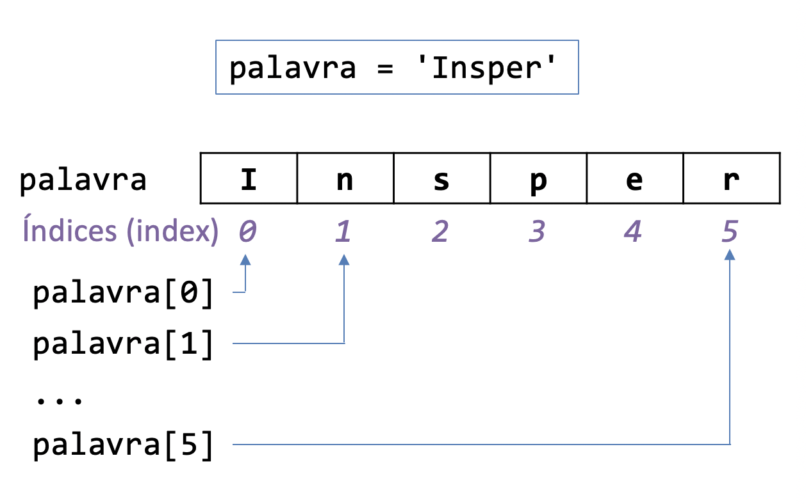
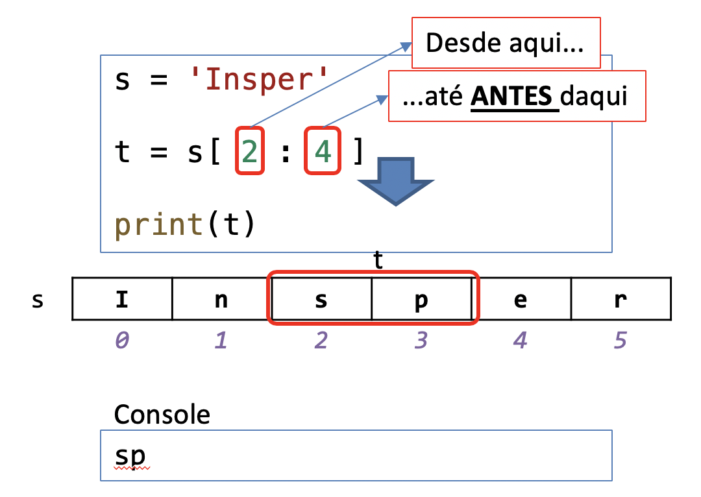
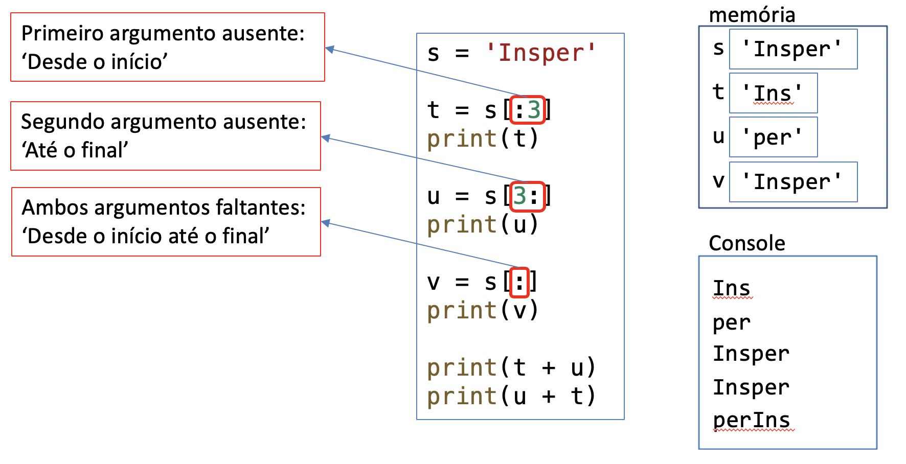
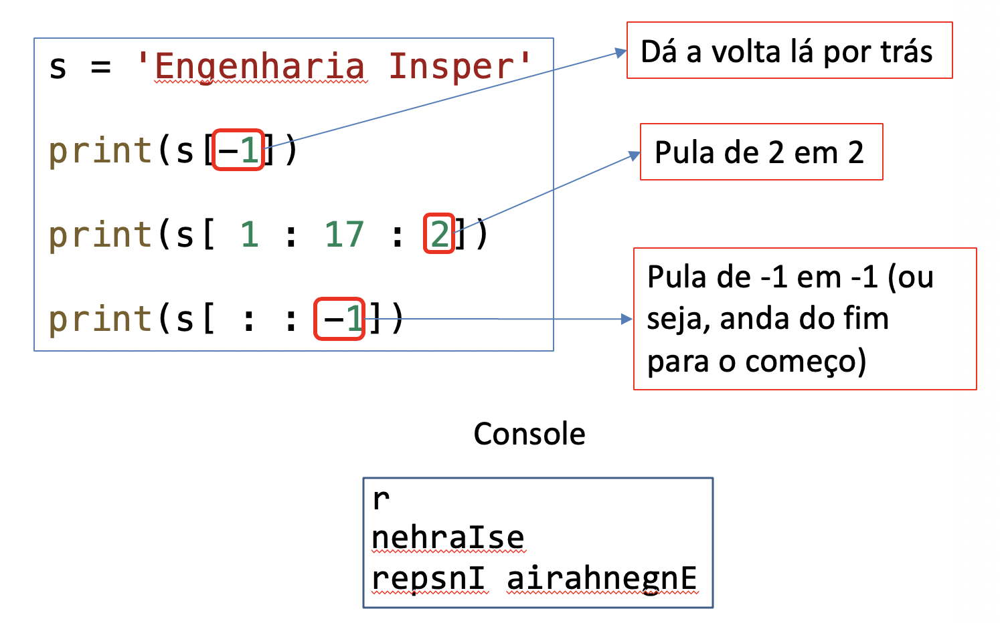

# 09. Strings e Fatiamento

Trabalhamos com strings desde a primeira aula, quando aprendemos a mostrar um texto na tela usando o `#!python print`. Hoje já sabemos fazer muito mais do que só mostrar um texto na tela! Ao final deste handout, o objetivo é que você seja capaz de utilizar operações comuns em strings, como encontrar e substituir substrings, limpar espaços em branco e obter fatias (*slicing*) de uma string ou lista.

Veremos que strings são muito parecidos com listas em diversos aspectos. O primeiro deles é que assim como em uma lista, os caracteres de uma string também podem ser acessados por índices:



:::admonition{type=exercise title="EXERCÍCIO 1"}
Faça o exercício :challenge{type=trace slug=imprimindo-caracteres-de-uma-string}.
:::

:::admonition{type=exercise title="EXERCÍCIO 2"}
Faça o exercício :challenge{type=code slug=conta-ocorrencias-de-a}.
:::

## Métodos de uma string

### O que são métodos?

Quando trabalhamos com listas sabemos que é possível usar o `#!python .append()` para adicionar um elemento. O Python sabe em qual lista ele deve adicionar o novo elemento porque o `#!python .append()` é sempre precedido pelo nome da lista. Por exemplo:

```python
lista1 = [1,2,3,4]
lista2 = [9,8,7,6]
lista1.append(5)
```

O número 5 será adicionado à `#!python lista1`, pois o `#!python append(5)` está associado a ela através do ponto (`#!python .`). Esse tipo especial de funções é o que chamamos de **método** (lembre-se que normalmente os argumentos de uma função são passados dentro dos parênteses). Por enquanto isso é tudo o que precisamos saber sobre um método: é uma função especial que está associada a um objeto (no caso uma lista) específico. Trabalharemos um pouco mais com métodos durante o projeto final de Design de Software. Para aqueles que forem seguir em Engenharia de Computação, o conceito de método será apresentado mais formalmente na disciplina Desenvolvimento Colaborativo Ágil.

### Alguns métodos de strings

Vimos em aulas anteriores que é possível criar uma nova string a partir de outras duas strings usando o `#!python +`: `#!python 'abcd' + 'efgh'` vai gerar a string `#!python 'abcdefgh'`. Assim, não precisamos do `#!python .append()` (de fato, ele nem funciona para strings). Mas existem diversos métodos específicos de strings que podem ser bastante úteis. Uma lista completa pode ser encontrada [na documentação](https://docs.python.org/3/library/stdtypes.html#string-methods), mas vamos focar em alguns métodos principais:

- **`find`**: método que retorna a posição da primeira ocorrência de uma dada string em outra. Se não encontrou, retorna -1. Por exemplo: `#!python 'abcde'.find('c')` devolve o número `#!python 2`.
- **`replace`**: método que recebe duas strings e retorna uma nova string com todas as ocorrências da primeira substituídas pela segunda. Por exemplo: `#!python 'abcba'.replace('b', 'd')` devolve a string `#!python 'adcda'`.
- **`strip`**: método que não recebe nenhum argumento e retorna uma nova string removendo os caracteres em branco (incluindo o caractere especial `#!python '\n'`) de ambas as pontas. Por exemplo: `#!python '   uma frase  \n'.strip()` devolve a string `#!python 'uma frase'` (note que o espaço do meio não é removido).
- **`split`**: método que recebe uma string delimitadora (ex: `#!python ','`) e retorna uma lista formada pela separação da string original pelo delimitador. Por exemplo: `#!python 'uma palavra, outra palavra, última palavra'.split(',')` devolve a lista `#!python ['uma palavra', ' outra palavra', ' última palavra']`. Se nenhum argumento for utilizado o delimitador utilizado será o espaço em branco. Por exemplo: `#!python 'palavras separadas por espaço'.split()` devolve a lista de strings `#!python ['palavras', 'separadas', 'por', 'espaço']`.
- **`join`**: método que recebe uma lista de strings e retorna uma única string separada pelo delimitador. Por exemplo: `#!python ' '.join(['a', 'b', 'c'])` devolve a string `#!python 'a b c'`. Outro exemplo: `#!python ','.join(['a', 'b', 'c'])` devolve a string `#!python 'a,b,c'`.

:::admonition{type=exercise title="EXERCÍCIO 3"}
Faça o exercício :challenge{type=trace slug=metodos-de-strings}.
:::

## Extraindo substrings com fatiamento

A operação de fatiamento permite realizarmos um recorte da string. A sintaxe é semelhante ao acesso a um caractere usando o índice, mas ao invés de um número nós passamos um intervalo:



A semântica é semelhante ao `#!python range`: o fatiamento inclui o primeiro índice e não inclui o segundo. Assim, no exemplo acima, o fatiamento `#!python s[2:4]` inclui o índice `#!python 2`, mas não inclui o `#!python 4`. Portanto apenas os caracteres nos índices `#!python 2` e `#!python 3` estão presentes no resultado do fatiamento.

Alternativamente, podemos omitir um (ou ambos) dos índices:



Assim como no range, podemos passar um terceiro argumento opcional para um fatiamento. Esse terceiro argumento indica o tamanho do pulo, ou seja, de quanto em quanto o índice deve ser aumentado (por padrão ele aumenta de 1 em 1). Por exemplo, `#!python 'abcdefghij'[0:10:2]` vai retornar uma nova string do índice 0 ao 9 pulando de 2 em 2, ou seja, a string `#!python 'acegi'`.

Além do fatiamento, pode ser útil usarmos índices negativos. Os índices negativos tem um efeito semelhante aos índices positivos, mas vão do final para o começo. Por exemplo, o índice `#!python -1` é o último elemento, o índice `#!python -2` é o penúltimo elemento, o índice `#!python -3` é o antepenúltimo elemento, e assim por diante.



No exemplo acima apresentamos uma técnica bastante utilizada para inverter uma string, que é o uso do fatiamento `#!python [::-1]`. Ele pode ser útil em alguns exercícios do servidor.

:::admonition{type=exercise title="EXERCÍCIO 4"}
Faça o exercício :challenge{type=trace slug=fatiamento-de-strings}.
:::

:::admonition{type=exercise title="EXERCÍCIO 5"}
Faça o exercício :challenge{type=code slug=verifica-palindromo}.
:::

## Fatiamento em listas

Dissemos no começo do handout que existem muitas semelhanças entre listas e strings em Python. Uma delas é que também é possível realizar fatiamentos de listas, da mesma maneira como fizemos com strings.

:::admonition{type=exercise title="EXERCÍCIO 6"}
Faça o exercício :challenge{type=trace slug=fatiamento-de-listas}.
:::

:::admonition{type=exercise title="EXERCÍCIOS ADICIONAIS"}
- :challenge{type=code slug=posicao-do-arroba}
- :challenge{type=code slug=nome-do-usuario}
- :challenge{type=code slug=listando-todos-os-sufixos-de-uma-string}
- :challenge{type=code slug=lista-alunos-impares}
- :challenge{type=code slug=forma-trios}
:::
