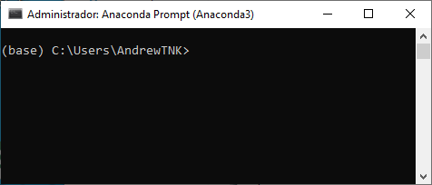
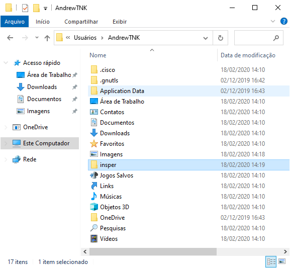
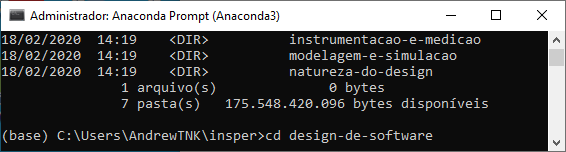

# Navegando Pelo Terminal (Windows)

Você já deve ter visto em algum filme uma cena como a mostrada acima: [um "hacker" digita comandos freneticamente em uma interface onde só aparecem comandos de texto ininteligíveis até que magicamente ele obtém os dados que todos julgavam ser impossível obter](http://hackertyper.com/). Interfaces de linha de comando podem assustar um pouco no começo, mas veremos que sabendo apenas 2 comandos já é possível utilizá-las para navegar pelos arquivos do computador.

Talvez você nunca tenha aberto o terminal/console/prompt do seu computador, mas ele está ([e sempre esteve](https://en.wikipedia.org/wiki/Command-line_interface)) lá! Vamos começar abrindo o terminal no nosso computador.

## Abrindo o Terminal

:::admonition{type="danger" title="Atenção"}
A partir deste ponto existem algumas diferenças entre os sistemas operacionais. **Este handout foi desenvolvido para usuários Windows**. Se você usa Mac OS X, consulte o [outro handout disponibilizado](/terminal-macos).
:::

No Windows, vamos utilizar uma versão alternativa do terminal chamada Anaconda Prompt. Ela foi instalada quando você instalou o Anaconda no seu computador. Para abrir o Anaconda Prompt clique em "Digite aqui para pesquisar" no canto inferior esquerdo (ou aperte a tecla `win`), digite "anaconda prompt" e aperte a tecla `enter`;

Não vamos entrar em detalhes, mas a principal informação que aparece antes do `>` é a sua pasta atual. Os comandos são digitados depois do `>`.

## O comando `dir`

Vamos começar pelo comando `dir`. Digite `dir` e aperte a tecla `enter`:

O comando `dir` lista os arquivos e pastas presentes na pasta atual. Funciona mais ou menos assim: imagine que você é um personagem de um jogo em uma sala (a pasta atual) com diversas informações (arquivos) e algumas portas (outras pastas). Todos os comandos que você executar serão executados na pasta atual. Por enquanto, vamos considerar duas possibilidades de ação:

1. Visualizar os arquivos disponíveis da pasta atual;
2. Navegar para outra pasta.

O comando `dir` realiza a primeira opção. Se você não mudou nenhuma configuração do terminal você sempre começa na pasta do seu usuário (também conhecida como sua *home*). Para verificar que o comando listou os arquivos e pastas disponíveis, vamos abrir o Explorador de Arquivos na mesma pasta:

## O comando `cd`

Agora vamos tentar a segunda opção: navegar para outra pasta. Para isso usamos o comando `cd`. Ele deve ser seguido do nome da pasta. Vamos entrar na pasta `insper` listada acima. Para isso vamos usar o comando `cd insper`.

:::admonition{type="danger"}
Os arquivos no seu computador provavelmente serão diferentes dos arquivos deste exemplo.
:::

:::admonition{type="danger"}
Os comandos executados anteriormente não são apagados.
:::

O comando `cd` não imprime nada no terminal. Esse é o resultado esperado. Vamos visualizar o conteúdo da pasta `insper`. Para isso, mais uma vez usamos o comando `dir`:

Vemos que essa pasta contém o arquivo `calendario.txt` e diversas pastas com nomes de disciplinas. Vamos entrar na pasta `design-de-software`. Mas antes disso, você notou que, na pasta atual, `design-de-software` é a única pasta que começa com as letras `des`? Além disso, o terminal acabou de listar as pastas, então em teoria ele "sabe" quais são as pastas e arquivos disponíveis. Não seria bom se eu pudesse escrever só o começo do nome da pasta e o terminal já completasse com o resto? E sim, ele faz isso! Podemos, por exemplo, digitar somente `cd des`:

Depois disso, ao apertar a tecla `tab`, o terminal vai completar o comando com o resto do nome:

No nosso exemplo, dentro da pasta `design-de-software` existe uma pasta `aulas`, que contém outras duas pastas `aula01` e `aula02`, que por sua vez contém 4 arquivos.

Pode ser um pouco cansativo usar um comando separado para entrar em cada pasta, ainda mais se você já souber o caminho completo. Por isso, também podemos avançar mais de um nível no comando `cd`, separando os nomes das pastas com uma barra invertida ('\\'):

Para verificar que estamos no lugar certo vamos usar, mais uma vez, o comando `dir`:

Finalmente, podemos também voltar para pastas acima da pasta atual. Para isso usamos o `..`, que se refere à pasta mãe. Por exemplo:

Vemos que agora estamos na pasta `aulas`:

Podemos também compor o `..` no caminho de uma pasta. Por exemplo: `..\..` são dois níveis acima da pasta atual.

Assim, depois de executar `cd ..\..` vemos que estamos novamente na pasta `insper`.
